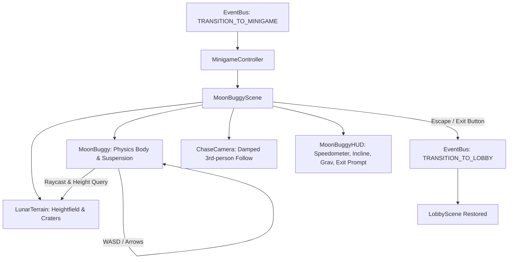

# Architectural Blueprint: Moon Buggy Minigame (Spec 02)

## 1. Overview & Context
The Moon Buggy minigame transports the player from the Playground Lobby into an authentic low-gravity lunar driving simulation. Players control an Apollo-inspired lunar rover navigating procedural undulating lunar terrain, craters, and boulders under 1/6th Earth gravity ($g \approx 1.62\,\text{m/s}^2$).

## 2. Technical Stack & Architecture Decisions (ADR-002)
- **Selected Engine / Physics Approach:** Custom analytical raycast-suspension & rigid body physics on Three.js.
  - *Rationale:* Lightweight, zero extra dependencies (no Cannon/Rapier WASM bloat needed for arcade-feel rover dynamics), deterministic lunar physics ($1.62\,\text{m/s}^2$), low-latency frame loop running on standard requestAnimationFrame.
- **Rendering & Atmosphere:**
  - True lunar environment: Pitch-black sky (`#000000`), starfield dome, harsh directional sunlight (no atmospheric scatter/diffusion), dark ambient bounce from lunar regolith (`#1a1a24`), high-contrast directional shadows.
  - Procedural Cratered Heightfield Terrain: Deformed plane with multi-octave simplex/crater displacement functions, lunar grey regolith shader material with vertex normal perturbations.
- **Minigame Lifecycle & Scene Management:**
  - `MoonBuggyScene` implements the minigame interface, mounting into `SceneManager`.
  - Seamless exit back to Lobby via event bus (`TRANSITION_TO_LOBBY`) or ESC / return prompt.

## 3. System Architecture & Component Flow



## 4. Interfaces & Contract Specifications

### 4.1 Lunar Rover Configuration & Physics State
```typescript
export interface RoverConfig {
  gravity: number;             // Default: -1.62 m/s^2 (Moon gravity)
  mass: number;                // Vehicle mass in kg (e.g., 250)
  engineForce: number;         // Drive acceleration force
  brakeForce: number;          // Braking deceleration
  maxSpeed: number;            // Top speed clamp (m/s)
  reverseMaxSpeed: number;     // Reverse speed clamp (m/s)
  steerAngleMax: number;       // Max wheel turn angle in radians
  steerSpeed: number;          // Steering responsiveness
  suspensionRestLength: number;// Rest height of chassis above ground
  suspensionStiffness: number; // Spring constant
  suspensionDamping: number;   // Damper coefficient
}

export interface RoverState {
  position: THREE.Vector3;
  velocity: THREE.Vector3;
  rotation: THREE.Euler;
  steering: number;
  throttle: number;
  isGrounded: boolean;
  speedKmh: number;
}
```

### 4.2 Terrain Height Query Interface
```typescript
export interface ILunarTerrain {
  getHeightAt(x: number, z: number): number;
  getNormalAt(x: number, z: number): THREE.Vector3;
  mesh: THREE.Mesh;
}
```

### 4.3 Minigame Scene Lifecycle
```typescript
export interface IMinigameScene {
  init(): void;
  update(delta: number): void;
  dispose(): void;
  scene: THREE.Scene;
}
```

## 5. 💡 Note to Future Self: Hosting Portability
- **Self-Contained Client Execution:** Physics calculations and procedural terrain generation run entirely in client memory without external server-side simulation or socket requirements.
- **Zero WebGL/WebGPU Lock-In:** Uses standard Three.js WebGL1/WebGL2 backwards-compatible geometries and materials, guaranteeing 60fps execution across mobile (Bazzite handhelds / chubbs) and desktop browsers.
- **Asset Fallback:** Procedural low-poly rover meshes and craters operate without external `.gltf` network dependencies, ensuring instant offline loads.
