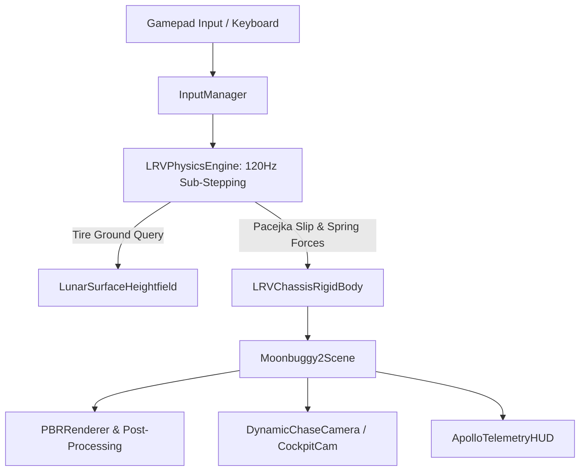

# Architectural Blueprint: Moonbuggy 2 High-Fidelity Simulator (Spec 03)

## 1. Overview & Architectural Goals
`Moonbuggy2` provides a photorealistic, physically validated Apollo Lunar Roving Vehicle (LRV) simulation tuned for the GPD Win Max 2 (`chubbs`). It introduces an analytical multi-body vehicle dynamics model (Pacejka tire slip, double-wishbone non-linear spring/damper, dual-axle Ackermann steering) and a PBR vacuum lighting pipeline with Earthshine and Hapke retro-reflective regolith shading.

## 2. Technical Stack & Decision Record (ADR-003)
- **Runtime Environment:** WebGPU / WebGL2 Three.js PBR Engine with native Gamepad API (XInput support on GPD Win Max 2).
  - *Rationale:* Zero platform installation barriers on Bazzite Linux; immediate 60fps hardware acceleration on AMD Radeon 780M (Mesa RADV/Vulkan backend); instant cross-network preview over Tailscale.
- **Physics Architecture:** Sub-stepped analytical vehicle dynamics (Runge-Kutta 4th order / Verlet sub-stepped at 120Hz inside a 60fps requestAnimationFrame loop) with 4-wheel independent raycast suspension and longitudinal/lateral tire slip calculation.
- **Visuals & Pipeline:**
  - PBR Metallic-Roughness materials with Triplanar regolith texturing.
  - Realistic Apollo LRV model: Gold aluminized Kapton foil with micro-bump roughness, woven zinc-mesh tires, high-gain dish mast, crew seating with restraint belts.
  - Directional vacuum lighting (zero Rayleigh scattering), specular glints, Earth ambient bounce.

## 3. System Architecture & Data Flow



## 4. Interface Contracts

### 4.1 LRV Physical Properties & Suspension Constants
```typescript
export interface LRVPhysicalParams {
  gravity: number;             // -1.622 m/s^2
  chassisMass: number;         // 210 kg empty, 460 kg loaded
  cgHeight: number;            // 0.42 m
  wheelbase: number;           // 2.30 m
  trackWidth: number;          // 1.83 m
  wheelRadius: number;         // 0.41 m
  suspensionRestLength: number;// 0.55 m
  springConstant: number;      // 32000 N/m
  damperBump: number;          // 2400 Ns/m
  damperRebound: number;       // 3600 Ns/m
  maxMotorTorque: number;      // 4 x 350 Nm
  maxSteerAngle: number;       // 0.44 rad (~25 deg)
}

export interface LRVTireState {
  grounded: boolean;
  contactPoint: THREE.Vector3;
  normal: THREE.Vector3;
  compression: number;
  suspensionForce: number;
  slipRatio: number;
  slipAngle: number;
  tractionForce: THREE.Vector3;
  angularVelocity: number;
}
```

### 4.2 Gamepad Controller Interface
```typescript
export interface GamepadSnapshot {
  steerX: number;       // -1.0 to 1.0 (Left stick)
  throttle: number;     // 0.0 to 1.0 (RT)
  brake: number;        // 0.0 to 1.0 (LT)
  handbrake: boolean;   // Button A
  reverse: boolean;     // Button X
  toggleCamera: boolean;// Button Y
  lookX: number;        // Right stick X
  lookY: number;        // Right stick Y
}
```

## 5. 💡 Note to Future Self: Hosting & Platform Portability
- **Engine Isolation:** `Moonbuggy2` is housed independently in `src/minigames/moonbuggy2/`. The original `src/minigames/moon-buggy/` remains untouched as the low-poly arcade reference.
- **Controller Decoupling:** Uses the W3C Standard Gamepad API mapping. The GPD Win Max 2 built-in controller registers as a standard Xbox 360/One controller in Bazzite SteamOS/KDE mode, functioning out of the box with zero external drivers.
- **GPU Scaling:** Runs at native 1080p/1200p on Radeon 780M at 60 FPS; adapts gracefully to lower-spec devices by scaling shadow map resolution and pixel ratios.
