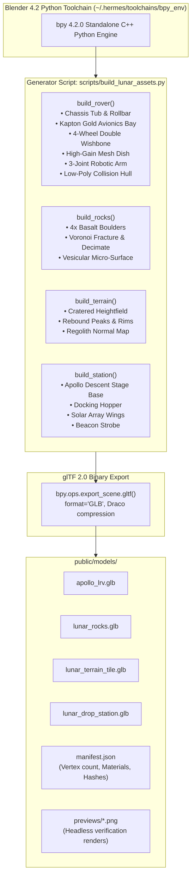

# Architecture Blueprint 05: Headless Blender 4.2 Asset & Export Pipeline

## 1. Pipeline Architecture & Data Flow

## 2. PBR Material Configuration & Node Schemas

| Material Identifier | Base Color (RGB) | Metallic | Roughness | Optical Function |
|---|---|---|---|---|
| `KaptonGoldFoil` | `(0.95, 0.65, 0.08)` | `0.92` | `0.22` | High-reflectance lunar thermal blanket |
| `AnodizedAluminum` | `(0.82, 0.84, 0.88)` | `0.85` | `0.38` | Structural tubular chassis frame |
| `WovenZincWireTire` | `(0.28, 0.30, 0.33)` | `0.70` | `0.65` | Apollo open-mesh compliant tires |
| `LunarBasalt` | `(0.18, 0.18, 0.19)` | `0.05` | `0.90` | Low-albedo vacuum-exposed boulder |
| `LanderFoilSilver` | `(0.90, 0.90, 0.92)` | `0.95` | `0.18` | Descent stage multi-layer insulation |

## 3. ADR-005: Blender Headless C++ Process Lifecycle & Exit Semantics
- **Context:** Standalone `bpy` initializes C++ worker thread pools and background memory allocations that do not terminate cleanly on standard Python exit, causing headless processes to hang indefinitely.
- **Decision:** The asset pipeline script enforces `os._exit(0)` immediately following glTF export completion and file verification.
- **Consequences:** Eliminates script hanging, enables clean integration into build pipelines, CI/CD, and multi-agent workflows.

---

## 💡 Note to Future Self: Hosting Portability
- The Blender asset generation pipeline is completely decoupled from the Three.js frontend runtime.
- Assets are generated headlessly into standard binary glTF 2.0 (`.glb`) files under `public/models/`.
- If the game engine is ported in the future from Three.js to a native engine (e.g. Godot 4, Raylib C++, Unreal, Bevy), the identical `.glb` files and collision proxies can be directly imported without regeneration.
- The Python generator can be executed on any x86_64 or ARM64 Linux system with `bpy` installed or via a standard Blender Docker container.
