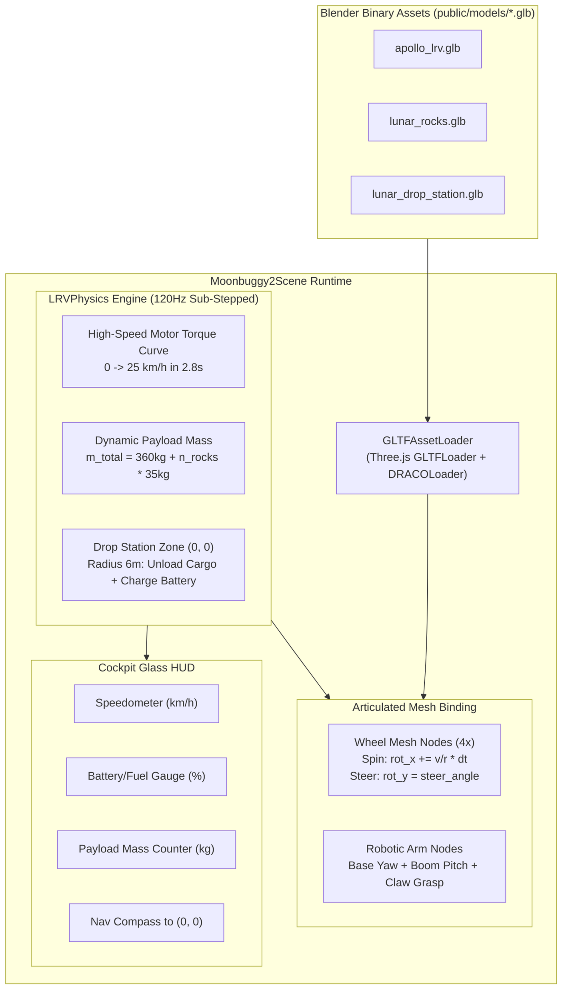

# Architecture Blueprint 06: Moonbuggy2 Engine Milestone 2 (GLTF Integration & Dynamics)

## 1. Engine Architecture & Scene Hierarchy

## 2. Dynamic Mass & Velocity Equations
$$\mathbf{a}_{\text{thrust}} = \frac{\mathbf{F}_{\text{motor}}}{m_{\text{base}} + N_{\text{rocks}} \cdot m_{\text{rock}}}$$
$$\mathbf{F}_{\text{downforce}} = (m_{\text{base}} + N_{\text{rocks}} \cdot m_{\text{rock}}) \cdot g_{\text{moon}}$$
Where:
- $m_{\text{base}} = 360.0\,\text{kg}$
- $m_{\text{rock}} = 35.0\,\text{kg}$
- $g_{\text{moon}} = 1.62\,\text{m/s}^2$
- Maximum speed governed at $v_{\max} = 25.0\,\text{km/h} = 6.944\,\text{m/s}$.

---

## 💡 Note to Future Self: Hosting Portability
- All gameplay and physics logic is decoupled from Three.js scene graphs via clean state interfaces (`VehicleState`, `PayloadState`, `StationState`).
- The sub-stepped physics math is 100% deterministic and pure TypeScript with zero DOM/WebGL dependencies, enabling seamless export to a WebWorker or a headless server authoritative simulation.
