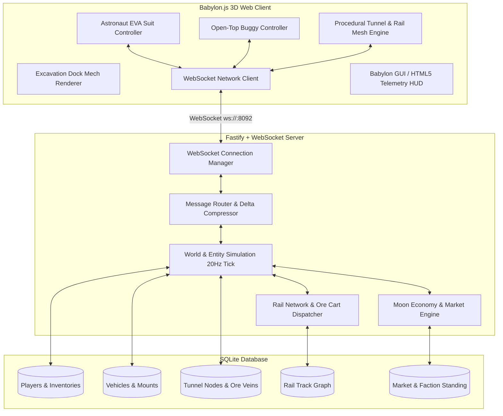

# Architectural Blueprint: Spec 12 — Lunar Frontier: Persistent Moon Economy & Multiplayer Subterranean Simulation

## 1. System Context & Overview



---

## 2. Architectural Decisions (ADR)

### ADR-012-1: Engine Selection — Babylon.js v7 vs Three.js
- **Context:** Previous minigames used Three.js for standalone client rendering. The user requested a "different tech stack" focusing on rich world-building, procedural subterranean tunnels, vehicle mounting, and multiplayer infrastructure.
- **Decision:** Use **Babylon.js v7** (`@babylonjs/core`, `@babylonjs/gui`).
- **Rationale:** Babylon.js provides built-in PBR materials, procedural ribbon/tube meshes (ideal for mining tunnels and rail lines), native camera rigging (FirstPerson UniversalCamera and ArcRotate/FollowCamera for vehicles), integrated particle systems for dust puffs and mining drills, and robust scene graph optimization.

### ADR-012-2: Multiplayer Authority & Protocol — Authoritative Server with Client Prediction
- **Context:** Players can walk in EVA suits, drive open-top rovers, lay rail tracks, and excavate mineral veins. Progress and persistence are critical.
- **Decision:** Fastify server hosting native `ws` WebSocket endpoints at 20Hz broadcast rate with SQLite persistence.
- **Rationale:** Prevents client-side state divergence, provides immediate persistence across disconnects/page reloads, and ensures mining claims and rail lines persist across all players.

### ADR-012-3: Subterranean Tunnel & Rail Representation
- **Context:** Tunnels dug into the lunar crust and rail lines connecting deep shafts to surface hubs.
- **Decision:** Graph-based spline network with 3D tubular mesh generation on the client.
- **Data Model:**
  - `TunnelNode`: $\{id, x, y, z, radius, parentId, oreVein: \{type, amount, excavated\}\}$
  - `RailTrack`: $\{id, fromNodeId, toNodeId, points: Vector3[], gauge: 0.75\}$
- **Client Rendering:** Babylon.js `MeshBuilder.CreateTube` and extruded cross-section profiles with procedural UV mapping and rock normal textures.

---

## 3. Data Schemas & API Contracts

### 3.1 Network Protocol (WebSocket JSON Frames)
```typescript
export type ClientMessage =
  | { type: 'JOIN'; callsign: string; faction: 'ARTEMIS' | 'POLAR_STAR' | 'HELIOS' | 'RUSTBELT' }
  | { type: 'INPUT_MOVE'; position: [number, number, number]; rotation: [number, number, number]; mode: 'EVA' | 'BUGGY' }
  | { type: 'ACTION_VEHICLE_ENTER'; vehicleId: string }
  | { type: 'ACTION_VEHICLE_EXIT'; vehicleId: string }
  | { type: 'ACTION_MINE_ORE'; tunnelId: string; targetOre: string; amount: number }
  | { type: 'ACTION_LAY_RAIL'; startPoint: [number, number, number]; endPoint: [number, number, number] }
  | { type: 'ACTION_TRADE'; resource: string; amount: number; isBuy: boolean };

export type ServerMessage =
  | { type: 'INIT_STATE'; selfId: string; world: WorldSnapshot }
  | { type: 'WORLD_DELTA'; timestamp: number; entities: EntityDelta[]; oreUpdates?: OreUpdate[] }
  | { type: 'RAIL_PLACED'; track: RailTrackDef }
  | { type: 'TUNNEL_EXPANDED'; segment: TunnelSegmentDef }
  | { type: 'MARKET_SYNC'; prices: Record<string, number> };
```

### 3.2 Database Schema (SQLite)
```sql
CREATE TABLE IF NOT EXISTS players (
  id TEXT PRIMARY KEY,
  callsign TEXT NOT NULL,
  faction TEXT NOT NULL,
  x REAL NOT NULL,
  y REAL NOT NULL,
  z REAL NOT NULL,
  yaw REAL NOT NULL,
  mode TEXT NOT NULL, -- 'EVA' or 'BUGGY'
  current_vehicle_id TEXT,
  inventory_json TEXT NOT NULL DEFAULT '{}',
  credits REAL NOT NULL DEFAULT 5000.0,
  updated_at INTEGER NOT NULL
);

CREATE TABLE IF NOT EXISTS vehicles (
  id TEXT PRIMARY KEY,
  type TEXT NOT NULL, -- 'OPEN_BUGGY', 'DOCK_MECH', 'RAIL_CART'
  owner_id TEXT,
  x REAL NOT NULL,
  y REAL NOT NULL,
  z REAL NOT NULL,
  heading REAL NOT NULL,
  cargo_json TEXT NOT NULL DEFAULT '{}',
  updated_at INTEGER NOT NULL
);

CREATE TABLE IF NOT EXISTS tunnels (
  id TEXT PRIMARY KEY,
  parent_id TEXT,
  start_x REAL NOT NULL,
  start_y REAL NOT NULL,
  start_z REAL NOT NULL,
  end_x REAL NOT NULL,
  end_y REAL NOT NULL,
  end_z REAL NOT NULL,
  radius REAL NOT NULL DEFAULT 3.0,
  ore_type TEXT,
  ore_remaining REAL NOT NULL DEFAULT 100.0,
  excavated_by TEXT
);

CREATE TABLE IF NOT EXISTS rail_tracks (
  id TEXT PRIMARY KEY,
  p0_x REAL NOT NULL,
  p0_y REAL NOT NULL,
  p0_z REAL NOT NULL,
  p1_x REAL NOT NULL,
  p1_y REAL NOT NULL,
  p1_z REAL NOT NULL,
  built_by TEXT,
  created_at INTEGER NOT NULL
);
```

---

## 4. 💡 Note to Future Self: Hosting Portability
- **Edge / Homelab Decoupling:**
  - The multiplayer server runs as a standard Node.js process using native WebSockets, requiring zero proprietary cloud dependencies.
  - The SQLite storage runs directly on NVMe on `beehive` or `chunkito` with zero external database provisioning.
  - In production or local homelab, the server can be fronted by Nginx / Caddy with WebSocket pass-through (`proxy_set_header Upgrade $http_upgrade; proxy_set_header Connection "upgrade"`).
  - The client assets compile into a static Vite distribution that can be hosted on Cloudflare Pages, S3, or served directly from the Fastify server.
