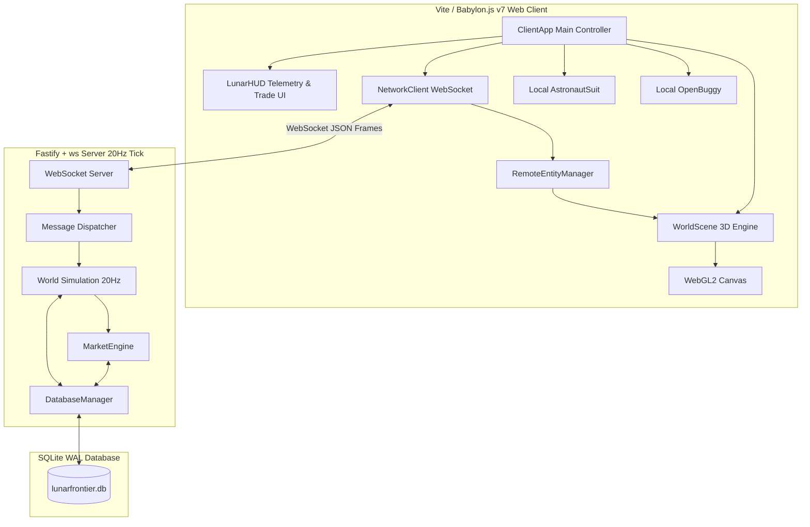

# Architectural Blueprint: Spec 12 Phase 8 — Interactive Babylon.js Web Client, Network Synchronization & Market Trading

## 1. Executive Summary & Objectives
Milestone 8 builds upon the verified foundations of Spec 12 (Phases 1–7) to deliver a complete, browser-playable, full-featured client and persistent market economy:
1. **Interactive Babylon.js Web Client Application (`src/client/ClientApp.ts`, `src/client/main.ts`, `index.html`)**:
   - Boots `WorldScene` inside a responsive WebGL2/WebGPU `<canvas>` in modern browsers.
   - Binds keyboard/mouse input controls to local player locomotion (EVA suit jump/sprint/RCS, buggy throttle/steering, interaction keys `[E]`, `[F]`, `[Q]`, `[C]`, `[M]`, `[T]`).
2. **WebSocket Network Client & Replication (`src/network/NetworkClient.ts`)**:
   - Manages client connection lifecycle (`hello`, `JOIN`, heartbeat `PING`/`PONG`, reconnect backoff).
   - Replicates remote players (rendering remote avatars in EVA suits, Buggies, or Mechs with dead reckoning / linear interpolation).
   - Replicates dynamic world objects: claim beacons, excavated tunnel nodes, and rail tracks.
3. **Life-Support & Vehicle Cockpit HUD (`src/ui/LunarHUD.ts`, `src/ui/hud.css`)**:
   - Telemetry overlay: Oxygen % bar, EVA battery %, Suit headlight status, Handheld Mineral Scanner readout.
   - Buggy dashboard: Speedometer (m/s & km/h), Cargo fill bar (0–500 kg), Battery %, Headlights status.
   - Proximity interaction prompts (`[E] Drive Buggy`, `[M] Mine Vein`, `[C] Stake Claim`, `[T] Trade`).
4. **Persistent Market Economy & Commodity Exchange (`src/economy/MarketEngine.ts`, server `TRADE` handling)**:
   - Server-authoritative trade endpoint (`ACTION_TRADE`) for lunar commodities (`REGOLITH`, `BASALT`, `TITANIUM`, `ILMENITE`, `HELIUM3`, `WATER_ICE`).
   - Automated market pricing curve based on supply/demand liquidity pools, backed by SQLite ACID transactions.
   - Periodic `MARKET_SYNC` broadcast keeping all client market terminal views synchronized.
5. **Vite Build & Playground Dev Server Integration**:
   - Clean TypeScript compilation and bundling (`npm run build` / `npm run dev`) for browser deployment.

---

## 2. Architecture & Data Flow



---

## 3. Network Protocol Extensions

### 3.1 Client Messages
```typescript
export type ClientMessage =
  | { type: 'JOIN'; payload: { username: string; faction: string; role?: string } }
  | { type: 'MOVE'; payload: { x: number; y: number; z: number; yaw: number; pitch?: number; vx?: number; vy?: number; vz?: number; mode: 'suit' | 'buggy' | 'mech' } }
  | { type: 'CLAIM'; payload: { x: number; y: number; z?: number; radius?: number } }
  | { type: 'MINE'; payload: { vein_id: string; amount?: number } }
  | { type: 'TRADE'; payload: { commodity: string; amount: number; is_buy: boolean } }
  | { type: 'LAY_RAIL'; payload: { p0: [number, number, number]; p1: [number, number, number] } }
  | { type: 'PING'; payload?: { t: number } };
```

### 3.2 Server Messages
```typescript
export type ServerMessage =
  | { type: 'welcome'; player_id: string; username: string; faction: string; credits: number; inventory: Record<string, number>; spawn: { x: number; y: number; z: number } }
  | { type: 'world_delta'; tick: number; players: Record<string, RemotePlayerState>; ore_updates?: OreUpdate[] }
  | { type: 'market_sync'; timestamp: number; prices: Record<string, number>; reserves: Record<string, number> }
  | { type: 'trade_confirmed'; trade_id: string; commodity: string; amount: number; total_credits: number; new_balance: number; inventory: Record<string, number> }
  | { type: 'claim_staked'; claim_id: string; player_id: string; x: number; y: number; radius: number }
  | { type: 'rail_placed'; rail_id: string; p0: [number, number, number]; p1: [number, number, number] }
  | { type: 'error'; code: string; message: string };
```

---

## 4. Market Pricing Algorithm (AMM / Bonding Curve)
Base prices ($P_0$) per unit (kg):
- `REGOLITH`: 5 credits
- `BASALT`: 15 credits
- `TITANIUM`: 45 credits
- `ILMENITE`: 75 credits
- `WATER_ICE`: 120 credits
- `HELIUM3`: 500 credits

Spot price formula with supply elasticity:
$$P(c) = P_0(c) \times \max\left(0.2, 1.0 + 0.5 \times \frac{\text{Baseline Reserve} - \text{Current Reserve}}{\text{Baseline Reserve}}\right)$$
Buying consumes local station reserves and drives spot price up; selling supplies the station and softens prices.

---

## 5. Architectural Decisions (ADR)

### ADR-013-1: DOM / Canvas Hybrid UI Architecture
- **Decision:** Use an HTML5/CSS glassmorphism overlay (`#lunar-hud`) styled over the WebGL `<canvas>` rather than heavy Babylon GUI 3D textured planes for core HUD meters.
- **Rationale:** Crisp text rendering on high-DPI displays (`chubbs`, handhelds, 4K monitors), zero texture-draw overhead, instant responsiveness, and full keyboard/pointer navigation for market dialogs.

### ADR-013-2: Dead Reckoning & Interpolation in NetworkClient
- **Decision:** Remote player avatars update target position/rotation vectors on 20Hz delta frames and lerp over 50ms render frames with position velocity projection.
- **Rationale:** Completely eliminates stutter and jitter on variable network latencies while keeping CPU load low.

---

## 6. 💡 Note to Future Self: Hosting Portability
- **Self-Contained Browser Bundle:** `games/lunar-frontier` compiles cleanly into static HTML/JS/CSS assets via Vite (`npm run build`), deployable to any static host (Cloudflare Pages, Nginx, GitHub Pages).
- **Decoupled WebSocket Endpoint:** `NetworkClient` auto-detects `location.host` or accepts an environment-driven `WS_URL` configuration, enabling edge hosting where backend shards run on `beehive`/`chunkito` while the UI is served via CDN.
