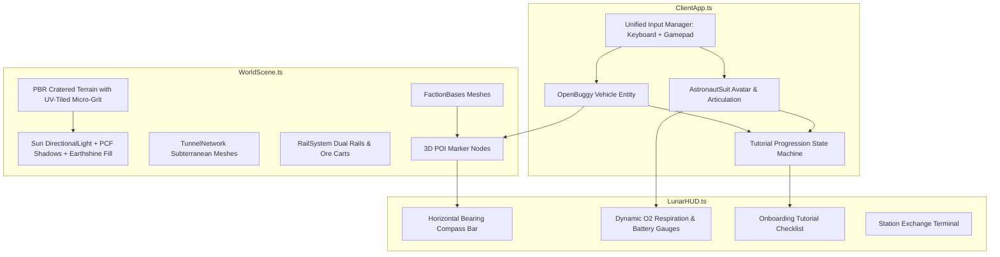

# Architectural Blueprint: Spec 14 — Lunar Frontier UX, Infrastructure, Navigation & Visual Overhaul

## 1. Executive Summary & Objectives
This specification rectifies core gameplay ergonomics, visual depth, spatial orientation, and simulation realism identified during initial browser dogfooding:

1. **Controls & Kinematics Rectification (`ClientApp.ts`, `GamepadController.ts`)**:
   - Invert reversed A/D, Left/Right arrow keys, and gamepad stick steering/strafe.
   - Integrate native Gamepad API polling for analog left stick and trigger throttle on handhelds (GPD Win Max 2 / Steam Deck).
2. **Photorealistic Surface Relief & High-Contrast Vacuum Lighting (`WorldScene.ts`)**:
   - Replace flat regolith lighting with high-frequency micro-relief UV-tiled normal mapping (tiled 64× across the 1024m terrain patch).
   - Hard directional sunlight casting crisp vacuum shadows onto the terrain (`receiveShadows = true`) with ambient Earthshine fill.
3. **Spatial Navigation, Waypoint Markers & Compass HUD (`LunarHUD.ts`, `CameraRig.ts`)**:
   - 3D in-world billboard waypoint beacons for critical points of interest: Parked Buggy, Faction Base Airlock, and Scanner-locked Mineral Veins.
   - Top-edge horizontal compass bar in the HUD (0°–360° with landmark icons).
4. **World Infrastructure Scene Integration (`ClientApp.ts`)**:
   - Mount and render `FactionBases` (geodesic domes, radar dishes, mining skid kits, dock mechs).
   - Mount and render `TunnelNetwork` (3D subterranean lava tube meshes and mineral vein geometry).
   - Mount and render `RailSystem` (dual steel rail splines, sleepers, and automated ore carts).
5. **Interactive Tutorial / Onboarding Flow (`LunarHUD.ts`, `ClientApp.ts`)**:
   - 5-step guided onboarding checklist:
     1. *Locomotion:* Move with WASD, hop with Space.
     2. *Recon:* Follow compass marker to scanner-locked vein.
     3. *Extraction:* Press `[M]` to extract ore.
     4. *Vehicle:* Mount buggy with `[E]` and throttle forward.
     5. *Commerce:* Press `[T]` to open the Trade Terminal and sell ore.
6. **Avatar Definition & Articulated Walking Animation (`AstronautSuit.ts`)**:
   - Sinusoidal counter-phase arm and leg articulation during walking and sprinting with subtle torso bobbing.
   - Higher-definition suit geometry: gold mirrored visor, backpack harness straps, and joint seals.
7. **Realistic Metabolic Respiration & Oxygen Depletion (`TraversalPhysics.ts`, `AstronautSuit.ts`)**:
   - Dynamic metabolic exertion rates: Idle ($1.0\times$), Walking ($1.8\times$), Sprinting ($4.5\times$), Buggy mounted ($0.4\times$ umbilical).
   - Visual breathing pulse on the O₂ HUD gauge.

---

## 2. Component Architecture & Data Flow

---

## 3. Detailed Technical Requirements

### 3.1 Controls & Input Mapping
- In `ClientApp.ts` `sampleInput()`:
  - Strafe: `const strafe = (p.has('KeyD') ? 1 : 0) - (p.has('KeyA') ? 1 : 0);` (Right = +1, Left = -1).
  - Steer: Align positive steering to clockwise heading azimuth change.
  - Gamepad: Poll `navigator.getGamepads()`, bind Left Stick X to steering/strafe, Left Stick Y to throttle, `A` to hop, `X` to mount/dismount, `Y` to toggle headlight.

### 3.2 Terrain Shading & Surface Detail
- In `WorldScene.ts`:
  - Regolith material normal map: Set `bumpTexture.uScale = 64; bumpTexture.vScale = 64;`.
  - Shadow reception: `terrainMesh.receiveShadows = true;`.
  - Material tuning: `albedoColor = Color3(0.20, 0.19, 0.18)`, `roughness = 0.94`, remove flat ambient emissive, let `sun` and `earthshine` provide natural contrast.

### 3.3 Infrastructure Integration in `ClientApp.ts`
- In `init(canvasOrEngine)`:
  - `this.factionBases = new FactionBases(snapshot).init(scene);`
  - `this.tunnels = new TunnelNetwork(snapshot).init(scene);`
  - `this.rails = new RailSystem(snapshot).init(scene);`
  - Register shadow casters for bases and rail carts.

### 3.4 Spatial Navigation & Waypoints
- In `ClientApp.ts` and `LunarHUD.ts`:
  - Calculate bearings to:
    1. Parked Buggy position.
    2. Nearest faction base center (`snapshot.bases`).
    3. Active locked mineral vein.
  - Render a top-of-screen compass band showing current heading (N, NE, E, SE, S, SW, W, NW) with tracked entity icons.

### 3.5 Onboarding Tutorial Checklist
- State machine in `ClientApp.ts`:
  - `step: 'move' | 'scan' | 'mine' | 'buggy' | 'trade' | 'complete'`
  - Emits step updates to `LunarHUD` to show an elegant non-intrusive HUD checklist in the top-right corner.

### 3.6 Suit Articulation
- In `AstronautSuit.ts`:
  - In `syncTransform(state)`:
    - If `speed > 0.05` and `isGrounded`:
      - Calculate walk phase $\theta = (\text{walkCycleTime} \times 8.0) \pmod{2\pi}$.
      - Leg L: `rotation.x = Math.sin(theta) * 0.45`
      - Leg R: `rotation.x = -Math.sin(theta) * 0.45`
      - Arm L: `rotation.x = -Math.sin(theta) * 0.35`
      - Arm R: `rotation.x = Math.sin(theta) * 0.35`
      - Torso bob: `position.y = baseTorsoY + Math.abs(Math.sin(theta * 2)) * 0.04`
    - Else: smooth lerp back to neutral standing pose.

### 3.7 Metabolic Respiration & Oxygen
- In `TraversalPhysics.ts`:
  - Base O₂ rate: 0.01 %/s.
  - Multipliers:
    - Idle: $1.0\times$
    - Walking ($v > 0.5$): $1.8\times$
    - Sprinting: $4.5\times$
    - Buggy mounted: $0.35\times$
