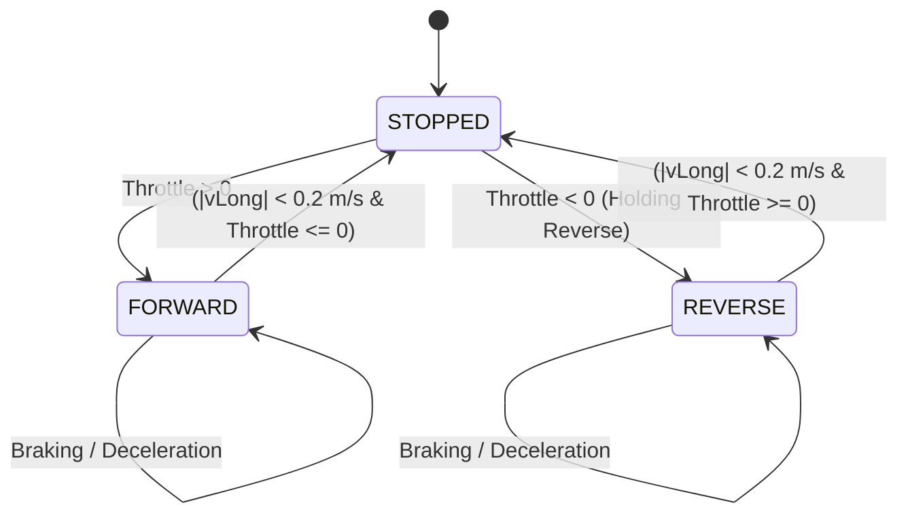

# Architectural Blueprint: Spec 15 — Lunar Buggy Overhaul, Unified Kinematics & Full Controller Tuning

## 1. Executive Summary & Root Cause Analysis

Dogfooding and player testing revealed three critical deficiencies in the lunar rover experience:
1. **Visual Primitive Jitter & Disconnected Assembly (`OpenBuggy.ts`)**:
   - The buggy was composed of disconnected geometric boxes/cylinders with suspension offsets and chassis tilts applied haphazardly across child primitives, leading to visual decoupling and floating components.
   - It lacked an authentic Apollo LRV / Artemis LTV aesthetic: missing roll cages, astronaut cockpit, realistic airless wire-mesh chevron wheels, wishbone suspension, and reactive lighting.
2. **Kinematic Drift & Asymmetrical Steer/Yaw (`TraversalPhysics.ts`)**:
   - Small numerical lateral forces or yaw relaxation produced perpetual drift when driving forward with zero steer input.
   - Steering lacked Ackermann geometry and high-speed derating, leading to twitchiness and sudden rollover.
3. **Erratic Powertrain & Broken Control Flow (`ClientApp.ts`, `CameraRig.ts`)**:
   - Abrupt torque application and binary reverse triggers caused jerkiness, stalling, or sudden lockups.
   - In vehicle mode, steering was misrouted through generic character strafe inputs without deadzones or curves, and the chase camera sat too far back without dynamic velocity-responsive FOV.

This blueprint establishes the complete architectural redesign for the 3D rover mesh hierarchy, deterministic low-gravity kinematics, seamless drive-mode state machine, unified keyboard/gamepad controller mapping, and verification testing.

---

## 2. Rover Visual Architecture (`OpenBuggy.ts`)

### 2.1 Cohesive Lunar Rover Mesh Hierarchy

All rigid chassis elements are grouped under a single rigid chassis root, guaranteeing zero relative translation or oscillation under heave, pitch, or roll. Suspension compression only translates the corner assemblies relative to the chassis tub.

```
[buggy-root] (Root TransformNode: handles physics world position, heading yaw, pitch & roll)
  ├── [buggy-tub-chassis] (Beveled structural chassis tub with underside skid plate)
  ├── [buggy-tubular-frame] (Rigid tubular roll cage & space frame protecting driver & cargo)
  ├── [buggy-front-cowl] (Sloped front nose cone, telemetry dish mast, and sensor pods)
  ├── [buggy-cockpit]
  │     ├── [buggy-seat-base] & [buggy-seat-back] (Form-fitting astronaut pilot bucket seat with harness)
  │     ├── [buggy-steering-t-bar] (T-handle lunar joystick controller on central pedestal)
  │     └── [buggy-dash-display] (Cockpit telemetry console with emissive status screen)
  ├── [buggy-cargo-bay]
  │     ├── [buggy-cargo-bed] (Ribbed rear cargo tray with side retention rails)
  │     └── [buggy-cargo-crates] (Dynamic mineral containers scaled/visible with cargoMass)
  ├── [buggy-lighting]
  │     ├── [buggy-lightbar] (Front horizontal crossbar housing dual LED projector headlights)
  │     ├── [buggy-headlight-l] & [buggy-headlight-r] (Directional SpotLights with lens caps)
  │     └── [buggy-taillights] (Dual rear red emissive LED indicators that brighten during braking)
  └── [buggy-suspension-corners] (4 articulated corner assemblies: FL, FR, RL, RR)
        └── [corner-pivot] (Tracks suspension vertical compression along spring travel)
              ├── [a-arms] (Upper and lower double-wishbone suspension arms)
              ├── [steering-knuckle] (Front corners only: steers around vertical Y-axis with steering angle δ)
              │     └── [wheel-hub] (Axle hub bearing)
              │           └── [road-wheel] (Airless compliant open-mesh rim + high-traction lunar chevron tread)
              └── [mud-flap] (Curved lunar regolith dust fenders mounted over each wheel)
```

### 2.2 PBR Materials & Aesthetic Palette

1. **Spacecraft Gold / Kapton Foil:** Avionics, battery enclosure, and front cowl insulation blankets (`metallic = 0.85, roughness = 0.25, albedo = Color3(0.92, 0.76, 0.20)`).
2. **Hazard Matte Yellow:** High-contrast coated structural roll bars and tubular crash cage (`metallic = 0.10, roughness = 0.55, albedo = Color3(0.82, 0.62, 0.12)`).
3. **Anodized Matte Aluminum:** Double wishbones, hubs, suspension links, and chassis skid plate (`metallic = 0.90, roughness = 0.35, albedo = Color3(0.75, 0.77, 0.80)`).
4. **Airless Open-Lattice Mesh / Chevron Tread:** Compliant wire-mesh tire treads with dark titanium chevron cleats (`metallic = 0.40, roughness = 0.85, albedo = Color3(0.18, 0.18, 0.20)`).
5. **Emissive Status Displays:** Cockpit dash screen and reactive rear LED taillights (albedo red, emissive red intensity boosts on brake).

---

## 3. Physics & Powertrain Overhaul (`TraversalPhysics.ts`)

### 3.1 Straight-Line Stability & Neutral Steer Kinematics

1. **Active Straight-Line Yaw Stabilizer:**
   When steering demand is zero ($|\text{steer}| < 10^{-3}$), steering angle $\delta = 0$ strictly, and an active straight-line yaw stabilizer is applied:
   $$M_{\text{damping}} = -k_{\text{yaw\_damp}} \cdot I_{zz} \cdot \dot{\psi}$$
   with $k_{\text{yaw\_damp}} \approx 8.0\,\text{s}^{-1}$, eliminating numerical yaw drift across long trajectories.
2. **Speed-Sensitive Steering Ratio:**
   To prevent high-speed rollover while maintaining responsive low-speed maneuvering:
   $$\delta_{\text{max}}(v) = \frac{\delta_0}{1 + 0.08 \cdot |v_{\text{long}}|}$$
3. **Ackermann Steering Geometry:**
   Inner and outer road wheels articulate at slightly different angles based on wheelbase $L$ and track width $W$:
   $$\delta_{\text{inner}} = \arctan\left(\frac{L}{\frac{L}{\tan\delta} - \frac{W}{2}}\right), \quad \delta_{\text{outer}} = \arctan\left(\frac{L}{\frac{L}{\tan\delta} + \frac{W}{2}}\right)$$

### 3.2 Drive Mode State Machine & Progressive Powertrain



1. **Progressive Motor Torque Rise:**
   Replace instantaneous torque steps with smooth first-order motor ramp-up:
   $$\tau_{\text{motor}} = \text{approach}(\tau_{\text{current}}, \tau_{\text{target}}, 4.0, dt)$$
   with hyperbolic continuous-power envelope:
   $$F_{\text{drive}} = \min\left(F_{\text{max}}, \frac{P_{\text{motor}}}{\max(|v_{\text{long}}|, 1.0)}\right)$$
2. **Natural Coasting & Rolling Resistance:**
   Smooth regolith rolling resistance coefficient $C_{\text{roll}} = 0.04$ smoothly decays forward velocity when throttle is released without abrupt jerking.
3. **Suspension Damping for 1/6th Lunar Gravity:**
   Damping ratio tuned for critical damping ($\zeta \approx 0.707$) under $1.62\,\text{m/s}^2$ surface gravity:
   $$\zeta = \frac{c_d}{2\sqrt{k_s \cdot m_{\text{corner}}}} \approx 0.707$$

---

## 4. Input Pipeline & Controller Calibration (`ClientApp.ts`, `CameraRig.ts`)

### 4.1 Unified Buggy Input Mapping
- Keyboard:
  - `KeyW` / `ArrowUp`: Forward throttle ($0 \to 1$).
  - `KeyS` / `ArrowDown`: Brake; reverse once stopped.
  - `KeyA` / `ArrowLeft`: Steer Left ($\delta < 0$).
  - `KeyD` / `ArrowRight`: Steer Right ($\delta > 0$).
  - `Space`: Handbrake (4-wheel lockup).
- Gamepad:
  - `Right Trigger (RT)`: Analog throttle ($0 \to 1$).
  - `Left Trigger (LT)`: Analog brake ($0 \to 1$).
  - `Left Stick X`: Smooth proportional steering with 15% inner deadzone and polynomial response ($x^{1.4}$).
  - `Left Stick Y` (pull back): Reverse from standstill.
  - `Button A`: Handbrake slide.
  - `Button X`: Mount / Dismount.
  - `Button Y`: Headlights toggle.

### 4.2 Camera Chase Behavior (`CameraRig.ts`)
- In `vehicle_chase` mode:
  - Distance: $7.5\,\text{m}$, Elevation: $2.8\,\text{m}$, Pitch tilt: $-12^\circ$.
  - Dynamic FOV expansion: $55^\circ \to 68^\circ$ proportional to speed ($v_{\text{long}} / v_{\text{max}}$).
  - Low-speed orientation stabilization preventing orbit swings during zero-speed turn-in-place or reverse transitions.

---

## 5. Verification Harness & Acceptance Gate

- `smoke-open-buggy.ts`:
  1. Rigid chassis hierarchy validation (chassis tub, roll cage, cockpit, cargo bed, lights share parent transform; suspension corners articulate relative to datum).
  2. 10-second straight-line throttle test with zero steering: $|\Delta y| < 0.05\,\text{m}$ across $>100\,\text{m}$ travel.
  3. Smooth progressive acceleration without torque spikes or discontinuous velocity jumps.
  4. Forward $\to$ Brake $\to$ Standstill $\to$ Reverse transition test.
  5. High-speed steering derating verification and rollover resistance.
- Regression suite:
  - `smoke-client-app.ts` passes (100%).
  - `smoke-traversal.ts` passes (100%).
  - `npm run build` succeeds cleanly.

---

## 6. 💡 Note to Future Self: Hosting Portability

All procedural meshes, PBR shaders, physics equations, and input mappings are purely decoupled from any cloud backend or native platform runtime. The simulation runs bit-identically in headless Node.js (`NullEngine`) and in WebGL2/WebGPU browsers across Linux, macOS, Windows, and SteamOS/handheld devices without requiring binary native addons.
