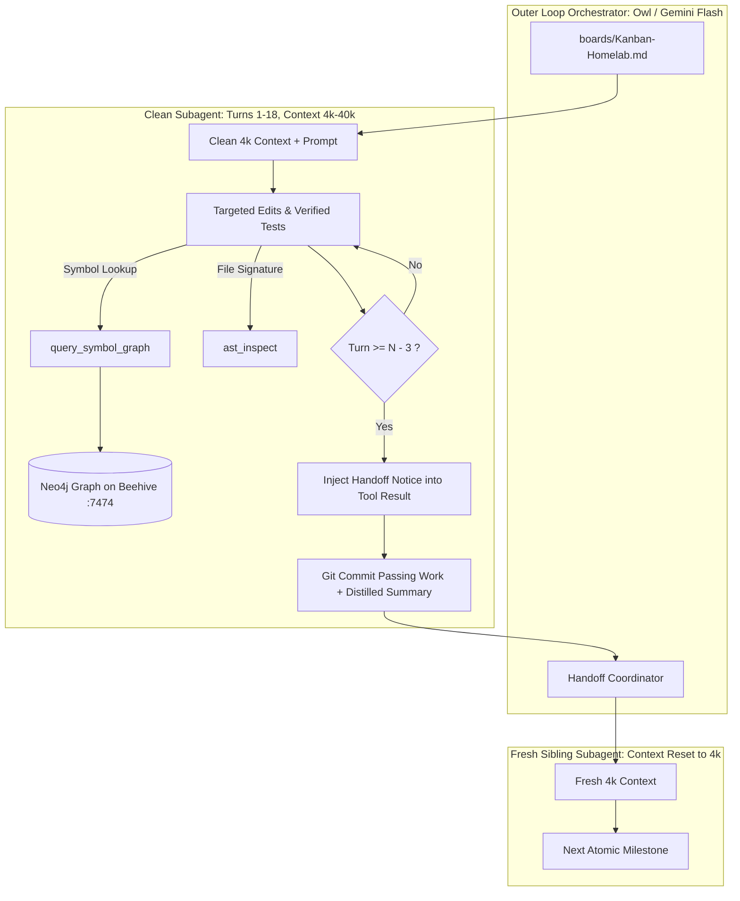

# Architecture Blueprint: Subagent Context Pruning, Turn-Budgeted Handoffs & Neo4j Interface Discovery

**Document ID:** `docs/architecture/15-subagent-context-pruning-and-turn-budgeting.md`  
**Related Spec:** `SPEC-HL-014` (`homelab/architecture/subagent-context-pruning-and-turn-budgeting-spec.md`)  
**Task ID:** `TASK-HL-123` (`TASK-HL-123a`, `TASK-HL-123b`, `TASK-HL-123c`)  
**Status:** In Progress  
**Authors:** 🦉 Owl (Lead Architect) & Pantheon Swarm

---

## 1. System Topology & Architecture Overview

During complex multi-step pipelines (e.g. 14-phase Lunar Frontier or complex system refactors), subagents executing on `chunkito` (`qwen3.8-flash-next:262k` 177B / `qwen3-coder-next:262k` 80B) suffer decode bandwidth degradation when context accumulates to 140k–160k tokens. At 140k tokens, streaming the KV cache across Strix Halo's 270 GB/s bus slows decode from ~45 tok/s to ~25 tok/s, while introducing reasoning drift from dead build logs and 1000-line whole-file reads.

This architecture decouples the execution lifecycle into three cooperative pillars:



---

## 2. Pillar Interface Contracts & Specifications

### Pillar 1: Turn-Budgeted Circuit Breaker (`TASK-HL-123a`)
- **Config & Argument Contract:**
  - `delegate_task(..., max_turns=20)` and task dictionary entries `{"goal": "...", "max_turns": 20}`.
  - Falls back to `delegation.max_turns` in `config.yaml` or default `DEFAULT_MAX_ITERATIONS` (25).
  - Child agent receives `max_iterations = max_turns`.
- **Automatic Handoff Injection Protocol:**
  - When turn count reaches $N - 3$ (e.g. turn 17 of 20), the agent's preparation loop injects an imperative checkpoint notice into the newest tool result:
    ```
    [SYSTEM NOTICE — Subagent Turn-Budget Circuit Breaker] You have reached turn {used} of {maximum} (3 turns remaining before the hard turn budget). Conclude your current step now: commit all passing code/artifacts with git, author a concise handoff summary of completed items and remaining tasks, and return your final response before running out of turns.
    ```
  - Safe against message alternation rules and KV prefix caching.

### Pillar 2: AST Extraction & Tool Output Pruning (`TASK-HL-123b`)
- **Command & API Contract:**
  - CLI: `python3 -m tools.ast_inspect <path> [--symbols SymbolA,SymbolB] [--outline]`
  - Python: `from tools.ast_inspect import inspect_ast`
  - Supports TypeScript (`.ts`, `.tsx`), JavaScript (`.js`, `.jsx`), and Python (`.py`).
  - Outline mode returns structural signatures (<50 tokens) instead of dumping 1,000+ line files.
- **Subagent SOUL Guidance:**
  - System prompts in `~/.hermes/profiles/{coder,jagular,tigger}/SOUL.md` are instructed to prefer `ast_inspect` over full-file `read_file` when only method signatures or interface contracts are needed.

### Pillar 3: Graph-Assisted Interface Discovery (`TASK-HL-123c`)
- **Neo4j Repository Symbol Schema:**
  - `(:Repository {name: "playground", path: "..."})`
  - `(:Module {name: "LunarServer.ts", path: "games/lunar-frontier/server/LunarServer.ts", language: "typescript"})`
  - `(:Interface {name: "PlayerSimState", exported_fields: "id: string, ...", file: "..."})`
  - `(:Class {name: "LRVPhysics", methods: "step(dt), applyThrottle(val), ...", file: "..."})`
  - `(:Function {name: "build_apollo_lrv", signature: "build_apollo_lrv(out_path: str)", file: "..."})`
  - Relationships: `[:CONTAINS]`, `[:EXPORTS]`, `[:DEPENDS_ON]`
- **REST Transaction Client:**
  - Uses native HTTP `http://100.99.188.15:7474/db/neo4j/tx/commit` with zero external binary dependencies.
- **Subagent Query Tool:**
  - `query_symbol_graph(symbol_name: str, repo: Optional[str] = None)` queries Neo4j and returns compact, 40-token answers directly into the context window.

---

## 3. Architecture Decision Records (ADRs)

### ADR-001: HTTP REST Transaction over Neo4j Python Driver
- **Context:** Subagents and local CLI tools need to read/write the Neo4j knowledge graph on `beehive`.
- **Decision:** Use standard Python `urllib.request` against `/db/neo4j/tx/commit` rather than requiring `neo4j` bolt driver wheels.
- **Consequences:** Eliminates dependency installation failure modes across fresh subagent virtualenvs, reduces cold-start latency, and matches existing homelab indexer patterns (`index_article_graph.py`).

### ADR-002: In-Tool-Result Notice Injection over Synthetic User Turn
- **Context:** At turn $N - 3$, the subagent must be warned to summarize and commit.
- **Decision:** Append the warning notice to the end of the most recent `tool` message content, identical to the `/steer` delivery protocol.
- **Consequences:** Maintains strict user/assistant/tool message alternation required by OpenAI/llama.cpp chat templates; preserves KV prefix cache hits across decode steps.

---

## 4. 💡 Note to Future Self: Hosting Portability

- **Cloud/Edge Decoupling:**
  - All symbol extraction (`ast_inspect.py`) and turn-budgeting mechanisms run completely locally in Python standard library without cloud LLM dependencies.
  - If Neo4j is offline or unreachable across Tailscale (`100.99.188.15:7474`), `query_symbol_graph` gracefully degrades by falling back to local `ast_inspect` or `search_files` without crashing.
  - The turn-budget circuit breaker operates autonomously inside the child execution engine, guaranteeing subagent termination and git checkpointing even if remote network links drop mid-task.
