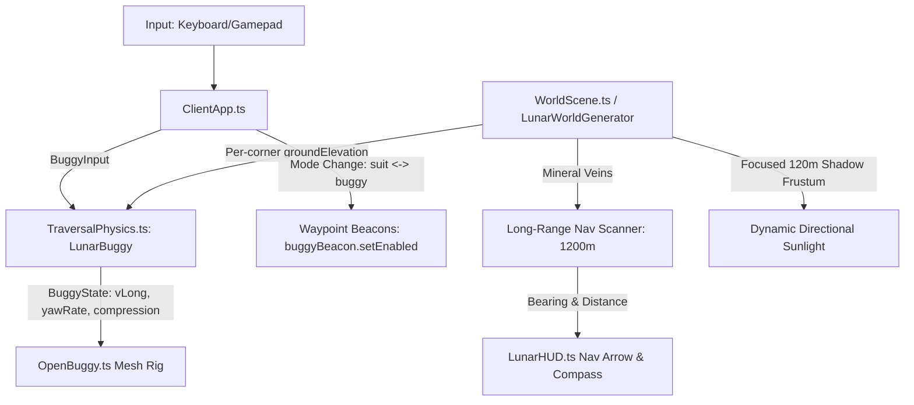

# Architecture Blueprint: Lunar Rover Experience, Terrain Texture & Navigation Overhaul

> **Reference Spec:** `specs/16-lunar-rover-experience-overhaul.md`  
> **Key Modules:** `ClientApp.ts`, `OpenBuggy.ts`, `TraversalPhysics.ts`, `WorldScene.ts`, `LunarWorldGenerator.ts`, `LunarHUD.ts`.

---

## 1. Subsystem Architecture & Data Flow

---

## 2. Key Architectural Decisions (ADR)

### ADR-016-1: Cockpit Waypoint Beacon Occlusion & State Coupling
- **Context:** The `buggyBeacon` is a tall vertical cylinder designed to guide the astronaut back to the parked buggy. When driving, having the beam originate from the buggy roof blocks forward vision.
- **Decision:** Drive `buggyBeacon.setEnabled(this.mode !== 'buggy')` deterministically during mode transitions and in `refreshWaypoints(now)`. The beacon never renders while the player occupies the driver seat.

### ADR-016-2: True Corner Ground Sampling & Damped Heave
- **Context:** The prior physics evaluated suspension damping against `vCorner - s.vBody` which was identically zero, causing the chassis to bounce continuously. It also assumed a flat plane across all 4 wheels.
- **Decision:** Sample `this.ground(cornerX, cornerY)` for each wheel individually. Apply a critically damped spring-damper model ($\zeta = 0.707$) on each corner and smooth the chassis attitude to track local ground slopes.

### ADR-016-3: Dynamic Sun Shadow Tracking Frustum
- **Context:** A static 4000m shadow box produced massive shadow texels (~2m per texel), rendering contact shadows and terrain relief completely invisible.
- **Decision:** Center the directional light's projection box dynamically on the active camera/vehicle with a tight 120m frustum and high-quality PCF filtering. This creates razor-sharp vacuum shadows under the wheels and along crater slopes.

### ADR-016-4: Long-Range Mineral Nav Guidance & HUD Arrow
- **Context:** The 80m scanner range left players driving aimlessly without knowing where mineral veins were located.
- **Decision:** Introduce a global/sector-level navigation sensor ($1200\text{m}$ scan envelope). Render a dynamic directional navigation arrow on the HUD and compass tape showing mineral type and distance to guide the driver directly to resources.

### ADR-016-5: Agile Low-Speed Torque Vectoring
- **Context:** At low speeds, turning the 2.7m wheelbase rover required wide loops, making quick turnarounds frustrating.
- **Decision:** At speeds $|v| < 4\,\text{m/s}$, apply differential drive torque between left and right wheel pairs proportional to steering angle, allowing fast U-turns and zero-radius pivot assistance.

---

## 3. 💡 Note to Future Self: Hosting Portability
All mathematical physics and coordinate transformations remain pure TypeScript with zero browser DOM dependencies. The navigation math, suspension dynamics, and terrain queries execute identically under headless Node.js test runners (`NullEngine`) and live WebGL2/WebGPU clients.
