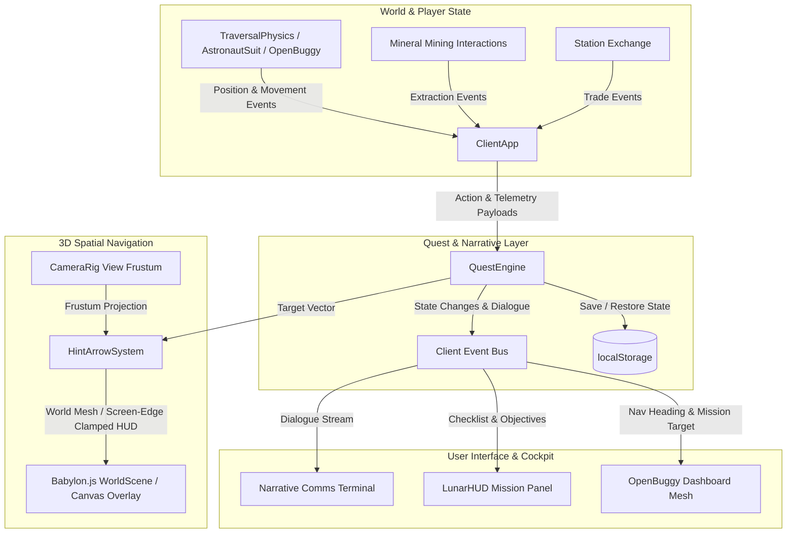

# Architecture 18: Lunar Frontier — New Player UX, Narrative Quest Framework & Tiered Resource Progression

> **Spec Reference:** `specs/18-new-player-ux-and-quest-framework.md`  
> **Target Subsystems:** `games/lunar-frontier/src/client/QuestEngine.ts`, `games/lunar-frontier/src/ui/LunarHUD.ts`, `games/lunar-frontier/src/ui/hud.css`, `games/lunar-frontier/src/entities/OpenBuggy.ts`, `games/lunar-frontier/src/client/ClientApp.ts`.

---

## 1. Subsystem Architecture & Event Flow



---

## 2. Key Component Contracts

### 2.1 `QuestEngine.ts`
- **Responsibilities:**
  - Manages active quests, stage transitions, and objective counts.
  - Subscribes to player locomotion, mineral extraction, vehicle mounting, and market trades.
  - Emits telemetry for the HUD, comms terminal, and dashboard display.
  - Serializes progress to local storage for persistent cross-session resumption.

### 2.2 `HintArrowSystem`
- **Responsibilities:**
  - Calculates the screen-space projection of the active quest target.
  - Determines if the objective is in front of or behind the camera frustum.
  - In-frustum: Renders a floating 3D neon chevron hovering above the objective in the Babylon scene.
  - Off-frustum: Clamps an edge-of-screen arrow indicator pointing toward the off-screen target with dynamic distance text.

### 2.3 `OpenBuggy.ts` Dash Screen Integration
- Dynamic texture canvas mapped onto the central dashboard console quad:
  - Corporate contractor badge / callsign.
  - Active quest title and current directive.
  - Dynamic navigation compass bearing and range-to-target.
  - Current payload weight / capacity meter.

---

## 3. Four-Tier Economic Game Loop Architecture

```
+------------------------------------------------------------------------------------+
| Tier 1: Survival (Polar Ice Traps)                                                 |
| - Mining Shackleton / Cabeus cold traps (40 K)                                     |
| - Sublimation mirrors & domes -> Potable Water -> Life Support O2                  |
+------------------------------------------------------------------------------------+
                                      |
                                      v
+------------------------------------------------------------------------------------+
| Tier 2: Orbital Propellant                                                         |
| - Cryo-electrolysis of H2O -> LH2 / LOX                                            |
| - Depots in Low Lunar Orbit (LLO) fueling cis-lunar transfer craft                 |
+------------------------------------------------------------------------------------+
                                      |
                                      v
+------------------------------------------------------------------------------------+
| Tier 3: Bulk Industry (Molten Regolith Electrolysis)                               |
| - Ilmenite & Silicate smelting at 1600°C                                           |
| - Bulk O2 gas + Slag metals (Fe, Ti, Al, Si) for 3D printed habs & truss systems   |
+------------------------------------------------------------------------------------+
                                      |
                                      v
+------------------------------------------------------------------------------------+
| Tier 4: Kinetic Export (Electromagnetic Mass Drivers)                              |
| - Superconducting surface tracks accelerating payloads to 2.38 km/s lunar escape   |
| - Direct ballistic flinging to Lagrange points L1/L2 and orbital shipyards         |
+------------------------------------------------------------------------------------+
```

---

## 4. Architectural Decision Records (ADRs)

### ADR 1: Staged State Machine with LocalStorage Persistence vs Ephemeral State
- **Context:** New players frequently refresh or reload web clients during tutorial onboarding. Losing progress forces repeated manual checklist actions.
- **Decision:** Implement `QuestEngine` with an explicit staged state machine serialized to `localStorage` under `lunar_frontier_quest_progress`. Expose reset and debug overrides.
- **Consequence:** Resilient onboarding across reloads, deterministic stage progression, and clean headless unit testing without requiring active browser DOM sessions.

### ADR 2: Frustum-Aware 3D Chevron with Screen-Edge Clamp vs Simple 2D Compass
- **Context:** A compass bar alone is insufficient for new players navigating low-contrast regolith terrains with rolling craters. Players look up and down without knowing if an objective is behind a crater ridge or off-screen.
- **Decision:** Implement dual-mode spatial projection: if an objective vector falls within the active camera view frustum ($z_{proj} > 0$ and within viewport coordinates), render a floating bobbing 3D holographic neon chevron. When off-screen ($z_{proj} \le 0$ or outside viewport bounds), calculate the screen-center radial vector and clamp a neon pointer chevron to the display perimeter with a distance readout.
- **Consequence:** Provides unambiguous 360-degree spatial guidance in both astronaut suit EVA and buggy driving modes.

### ADR 3: In-Cockpit Dashboard Dynamic Canvas vs Exclusive Screen HUD
- **Context:** Relying strictly on screen-space HUD overlays breaks immersion during vehicular rover exploration.
- **Decision:** Bind a Babylon.js `DynamicTexture` to the center console dashboard quad of `OpenBuggy.ts`. Update this texture with corporate contractor telemetry, active objective, target distance, and cargo capacity whenever the player enters the vehicle.
- **Consequence:** Grounded, diegetic UI feedback that strengthens the tactile feel of driving an industrial contractor rover on the lunar surface.

---

## 5. 💡 Note to Future Self: Hosting Portability

The Quest Engine, spatial hint projection, comms terminal, and buggy dashboard dynamic texture operate entirely within the client-side Babylon.js runtime and HTML5 canvas layer. No server-side state or native binaries are required for single-player questing, tutorial onboarding, or spatial navigation. When running against the persistent Fastify + SQLite multiplayer server (`LunarServer.ts`), the quest engine hooks cleanly into authoritative network trading and mineral extraction events while maintaining client-side deterministic state caching.

