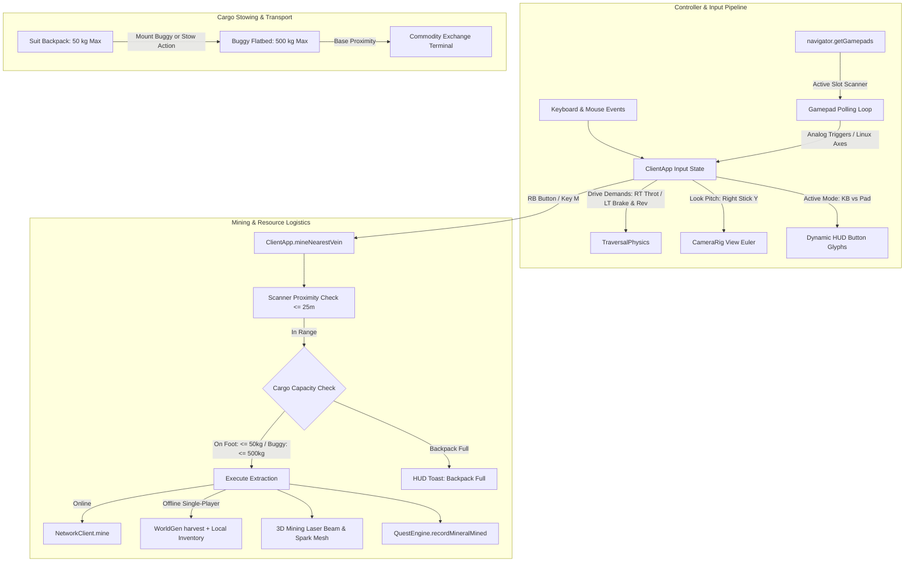

# Architecture 19: Lunar Frontier — Gamepad Controls Overhaul, Mining UX & Tiered Cargo Capacity

> **Spec Reference:** `specs/19-lunar-frontier-gamepad-controls-and-mining-ux.md`  
> **Target Subsystems:** `games/lunar-frontier/src/client/ClientApp.ts`, `games/lunar-frontier/src/ui/LunarHUD.ts`, `games/lunar-frontier/src/ui/hud.css`, `games/lunar-frontier/src/entities/AstronautSuit.ts`, `games/lunar-frontier/src/entities/OpenBuggy.ts`, `games/lunar-frontier/src/engine/WorldScene.ts`.

---

## 1. Subsystem Architecture & Event Flow



---

## 2. Key Component Contracts & Interface Schemas

### 2.1 Gamepad Input Mapping (`ClientApp.ts`)

```typescript
export interface GamepadButtonMapping {
  jump: number;        // A (0)
  trade: number;       // B (1)
  mount: number;       // X (2)
  headlight: number;   // Y (3)
  sprintLeft: number;  // LB (4)
  mine: number;        // RB (5)
  brake: number;       // LT (6)
  throttle: number;    // RT (7)
  comms: number;       // D-Pad Up (12)
  camera: number;      // R3 (11)
}

export interface GamepadAxisMapping {
  strafe: number;      // Left Stick X (0)
  forward: number;     // Left Stick Y (1)
  yaw: number;         // Right Stick X (2)
  pitch: number;       // Right Stick Y (3)
  linuxLtTrigger: 4;   // Linux XInput LT (4)
  linuxRtTrigger: 5;   // Linux XInput RT (5)
  altTrigger: 2;       // DirectInput Alternative RT (2)
}
```

### 2.2 Cargo & Stowing Contracts (`AstronautSuit.ts`, `OpenBuggy.ts`)

```typescript
export const SUIT_MAX_CARGO_KG = 50;
export const BUGGY_MAX_CARGO_KG = 500;

export interface CargoCarrier {
  getCargoMass(): number;
  setCargoMass(massKg: number): number;
  getCargoCapacity(): number;
  canAcceptCargo(amountKg: number): boolean;
  addCargo(amountKg: number): number;
}
```

### 2.3 3D Mining Visual Effect (`WorldScene.ts`)

```typescript
export interface MiningBeamEffect {
  startPos: { x: number; y: number; z: number };
  endPos: { x: number; y: number; z: number };
  durationMs: number;
  colorHex: string;
}
```

---

## 3. Architectural Decision Records (ADRs)

### ADR 1: Unified Active-Gamepad Polling vs Static Index 0
- **Context:** Many modern OSs (Linux, ChromeOS, macOS) enumerate virtual devices, Bluetooth audio accessories, or dormant remotes at index 0 of `navigator.getGamepads()`. Relying on `pads[0]` causes dead controllers.
- **Decision:** Inspect all connected gamepad objects across indices $0 \dots 3$ each frame. If any stick or button exceeds deadband ($>0.15$), update `activeGamepadIndex` to that slot. Fall back to the previously active index if neutral.
- **Consequence:** Seamless hotplugging and zero dead-controller failures across Linux desktops and handhelds.

### ADR 2: Trigger Brake-to-Reverse State Machine vs Dedicated Reverse Button
- **Context:** Requiring a separate button or stick-down movement to reverse while driving with RT/LT triggers feels counterintuitive and clunky compared to modern driving titles.
- **Decision:** In buggy driving mode, if longitudinal speed is near zero ($|v| \le 0.3\,\text{m/s}$) and the brake trigger is held ($\text{LT} \ge 0.15$), transition `driveMode` to `REVERSE` and route LT pressure directly into reverse torque. Releasing LT or pressing RT instantly re-engages forward drive.
- **Consequence:** Natural, intuitive driving controls identical to mainstream driving titles.

### ADR 3: Dedicated Screen-Space HUD Toast vs Modal Trade Feedback
- **Context:** `ClientApp` was routing gameplay notifications (`no vein in range`, `offline cannot mine`, `buggy out of reach`) to `#trade-feedback` inside `#trade-dialog`, which is completely hidden outside the trading modal.
- **Decision:** Introduce `#lunar-hud-toast` in `LunarHUD.ts` positioned as a semi-translucent glassmorphic pill banner at the top-center of the viewport. Route all operational feedback there with automatic 3.5s dismiss.
- **Consequence:** Instant, high-contrast player feedback for all world actions regardless of UI state.

### ADR 4: Dual-Tier Cargo Capacities (50 kg Suit vs 500 kg Buggy)
- **Context:** Without cargo limits on foot, the player has little logistical incentive to drive the lunar rover or plan haulage trips.
- **Decision:** Enforce a strict $50\,\text{kg}$ backpack capacity on the astronaut suit and a $500\,\text{kg}$ flatbed capacity on the buggy. Provide an instant `Stow to Buggy` interaction when near the rover and auto-transfer backpack haul upon mounting.
- **Consequence:** Clear mechanical justification for deploying the rover, creating an engaging gather $\to$ haul $\to$ trade gameplay loop.

---

## 4. 💡 Note to Future Self: Hosting Portability

All gamepad polling, input shaping curves, local offline extraction fallbacks, 3D laser rendering, and cargo stowing mechanics are completely decoupled from Node or platform-specific binaries. They operate purely within standard W3C Gamepad and DOM APIs and Babylon.js WebGL/WebGPU shaders. When running in offline or disconnected single-player environments (e.g. static CDN, GitHub Pages, Cloudflare Pages), the local world generator and inventory system simulate full extraction and quest progression faithfully without requiring the Fastify server.
