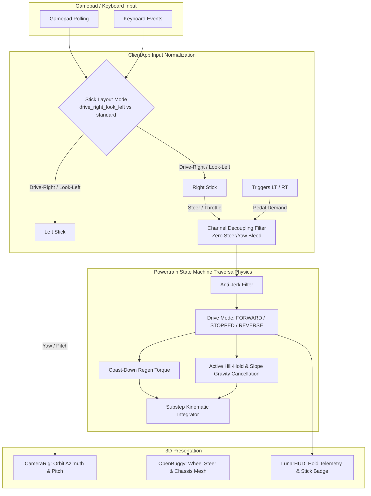

# Architecture Blueprint: Buggy Hill-Hold Zero-Drift & Dual-Stick Decoupled Layout

> **Spec Reference:** `specs/20-lunar-frontier-hill-hold-drift-fix-and-stick-layout.md`  
> **Target Subsystems:** Powertrain Physics (`TraversalPhysics.ts`), Client Controller (`ClientApp.ts`), HUD (`LunarHUD.ts`), Camera (`CameraRig.ts`).

---

## 1. System Context & Component Interaction

---

## 2. Mathematical & Algorithmic Specifications

### 2.1 Powertrain Coast Regen & Slope Gravity Cancellation

#### Coast-Down Braking Force
When driver throttle is in the deadband ($|\text{throttle}| \le 0.05$):
$$F_\text{coast} = -\text{sign}(v_\text{long}) \cdot \min(F_\text{coast\_max}, \frac{|v_\text{long}| \cdot m}{\Delta t})$$
where $F_\text{coast\_max} = 1,800\,\text{N}$.

#### Slope Gravity Balance
On an inclined plane of pitch angle $\theta_p$ and roll angle $\phi_r$:
$$F_{g,\text{long}} = -m \cdot g \cdot \sin(\theta_p) \cdot \cos(\phi_r)$$
$$F_{g,\text{lat}} = m \cdot g \cdot \sin(\phi_r)$$

When `driveMode === 'STOPPED'` and $|\text{throttle}| \le 0.05$:
$$\Sigma F_\text{hold,long} = -F_{g,\text{long}}$$
$$\Sigma F_\text{hold,lat} = -F_{g,\text{lat}}$$
$$\mathbf{v}_\text{body} = \mathbf{0}, \quad \omega_z = 0$$

Holding authority is bounded by Coulomb friction:
$$|F_\text{hold}| \le \mu \cdot N = \mu \cdot m \cdot g \cdot \cos(\theta_p)$$
On lunar regolith ($\mu = 0.68$), maximum static hold angle is:
$$\theta_\text{max} = \arctan(\mu) \approx 34.2^\circ$$
which easily covers all standard craters ($< 25^\circ$).

---

### 2.2 Dual-Stick Decoupled Channel Architecture

| Channel | Standard Layout | Drive-Right / Look-Left (User Default) | Curve / Deadband |
| :--- | :--- | :--- | :--- |
| **Left Stick X (`axes[0]`)** | Vehicle Steer | Camera Yaw (Look Horizontal) | $dz = 0.15, \gamma = 1.5$ |
| **Left Stick Y (`axes[1]`)** | Vehicle Throttle | Camera Pitch (Look Vertical) | $dz = 0.15, \gamma = 1.5$ |
| **Right Stick X (`axes[2]`)**| Camera Yaw | Vehicle Steer (Wheel Deflection) | $dz = 0.12, \gamma = 1.6$ |
| **Right Stick Y (`axes[3]`)**| Camera Pitch | Vehicle Throttle (Forward/Reverse) | $dz = 0.15, \gamma = 1.4$ |
| **Right Trigger (RT)** | Analog Throttle | Analog Throttle (Additive Max) | $dz = 0.05, \gamma = 1.4$ |
| **Left Trigger (LT)** | Analog Brake / B2R | Analog Brake / B2R | $dz = 0.05, \gamma = 0.8$ |

---

## 3. ADR (Architectural Decision Records)

### ADR-20-1: Automatic Powertrain Hill-Hold vs Manual Handbrake Requirement
- **Context:** Previous design relied on the player manually pressing `[Space]` or gamepad Button A (`parkBrake`) to engage the park brake on hills. Operators frequently release controls expecting modern EV one-pedal hill-hold behavior.
- **Decision:** Elevate hill-hold to an automatic powertrain capability whenever the rover drops below crawl speed ($0.35\,\text{m/s}$) with neutral throttle, while preserving manual handbrake as an emergency/drift control.
- **Consequences:** Eliminates frustrating downhill drift without requiring constant button holding.

### ADR-20-2: Stick Layout Mode Configuration & Runtime Switch
- **Context:** Operators have diverse muscle memory across twin-stick arcade games (RC flight vs Halo/Forza conventions).
- **Decision:** Provide an explicit `GamepadStickLayout` configuration persisted in `localStorage` with `drive_right_look_left` as the primary requested profile and `standard` as selectable alternate.
- **Consequences:** Fully satisfies user requirement while preventing regressions for existing control setups.

---

## 4. 💡 Note to Future Self: Hosting Portability
All physics updates execute strictly inside deterministic headless simulation modules (`TraversalPhysics.ts`). No Babylon or WebGL dependencies are introduced into the core powertrain math, ensuring 100% testability on Node NullEngine and headless CI harnesses.
