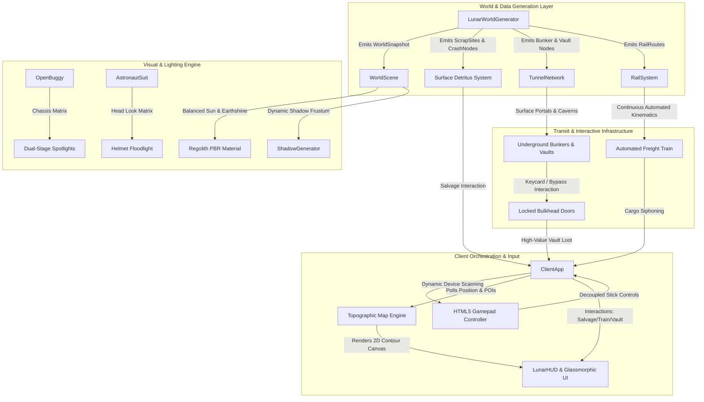

# Architectural Blueprint: Spec 21 — Lunar Frontier World Building, Atmospheric Lighting, Rail Traffic, Tunnel Facilities, Topographic Map & Gamepad Rectification

> **System Component:** `games/lunar-frontier`  
> **Target Subsystems:** Procedural World Generation, Airless Lighting Engine, Subterranean Infrastructure, Rail Transit, Topographic HUD & Gamepad Input Pipeline.  
> **Status:** APPROVED CONTRACT  

---

## 1. Subsystem Architecture & Data Flow



---

## 2. Interface Schemas & Data Contracts

### 2.1 Detritus & Scrap Types
```typescript
export type ScrapArchetype = 'lander_wreck' | 'mining_rig' | 'junk_pile';

export interface ScrapComponent {
  id: string;
  name: string;
  massKg: number;
  valueCredits: number;
  icon: string;
}

export interface ScrapSite {
  id: string;
  archetype: ScrapArchetype;
  position: Vec3;
  harvested: boolean;
  components: ScrapComponent[];
  boundingRadiusM: number;
}
```

### 2.2 Bunker & Vault Infrastructure Types
```typescript
export interface VaultLootItem {
  id: string;
  name: string;
  kind: 'fuel_cell' | 'suit_upgrade' | 'cryo_canister' | 'drill_bit';
  description: string;
  batteryKwhBonus?: number;
  cargoCapacityBonusKg?: number;
  creditValue: number;
}

export interface UndergroundBunker {
  nodeId: string;
  name: string;
  center: Vec3;
  dimensions: { width: number; length: number; height: number };
  doorState: 'locked' | 'unlocked' | 'open';
  lootItems: VaultLootItem[];
}
```

### 2.3 Topographic Map Contract
```typescript
export interface TopoMapPOI {
  id: string;
  label: string;
  kind: 'base' | 'mining_vein' | 'portal' | 'train' | 'scrap' | 'player';
  x: number;
  y: number;
  heading?: number;
  color: string;
  resourceKind?: ResourceKind;
}

export interface TopoMapState {
  visible: boolean;
  canvasWidth: number;
  canvasHeight: number;
  worldSizeM: number;
  center: { x: number; y: number };
  zoom: number;
  pois: TopoMapPOI[];
}
```

---

## 3. Architecture Decision Records (ADRs)

### ADR-021-1: Procedural Composite Geometry for Surface Detritus & Vaults
- **Context:** The lunar frontier requires distinctive crashed landers, rusted mining rigs, and vault bulkheads without introducing heavy external GLB assets that increase network payload, break offline tests, or complicate headless `NullEngine` CI execution.
- **Decision:** Build all detritus, portal arches, and vault bulkheads from composite procedural Babylon.js primitives (`MeshBuilder.CreateBox`, `CreateCylinder`, `CreatePolyhedron`) styled with dedicated procedural PBR materials (oxidized Kapton foil, rusted steel, reinforced concrete).
- **Consequences:** Instantaneous loading, zero network fetches, deterministic seed-based reproduction, and full testability on headless CI runners.

### ADR-021-2: Balanced Dynamic Lighting & Chassis Matrix Spotlights
- **Context:** The previous 40:1 lighting ratio (sun 3.1 vs earthshine 0.08) caused pitch-black shadows and blown-out whites. Buggy headlights were locked to world horizon $y=0$, blinding players on inclines.
- **Decision:** Balance sun intensity to $2.2$ and earthshine to $0.24$. Recompute buggy headlight origins and forward direction from the chassis transformation matrix (`chassis.getWorldMatrix()`), depressing the beam $4^\circ$ below the longitudinal chassis axis to track terrain slopes.
- **Consequences:** Eliminates pitch-black crater traps while preserving stark vacuum shadows; headlights illuminate terrain dips and hills realistically during traversal.

### ADR-021-3: Hardware-Resilient Gamepad Filtering & Dormant Browser Wake-Up
- **Context:** Handheld gaming PCs (GPD Win Max 2, Steam Deck) and virtual devices expose non-controller sensor nodes at `gamepads[0]`, leading to dead controller locks. Browsers keep the Gamepad API dormant until a button is pressed.
- **Decision:** Implement multi-device scanning each frame, requiring $\ge 6$ buttons and $\ge 2$ axes to qualify. Hook `window.addEventListener('gamepadconnected')` and surface a visual HUD prompt (`PRESS ANY BUTTON ON CONTROLLER TO ACTIVATE`) when no active controller is registered.
- **Consequences:** Seamless controller pickup across handhelds and desktop gamepads without requiring manual index configuration.

---

## 4. 💡 Note to Future Self: Hosting Portability

All world structures, detritus sites, and terrain generation remain purely algorithmic and seed-reproducible. Nothing is tied to local filesystem paths or server-specific network architectures. The client can run as a fully standalone static single-player WebAssembly/WebGL application or connected to distributed authoritative shard servers without modification.
