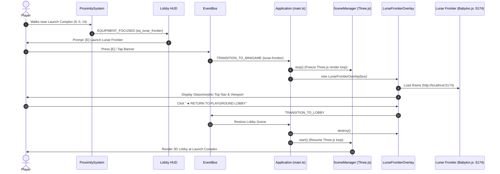

# Architectural Blueprint: Playground Lobby — Lunar Frontier Integration (Spec 22)

## 1. Overview & Context
The Playground Lobby (Spec 01) is the central 3D hub connecting all minigames in the repository. While Moon Buggy (Spec 02) and Moonbuggy 2 (Spec 03) run on the same Three.js engine and swap scenes in-process, Lunar Frontier (Specs 12–21) is a full-featured, persistent multiplayer moon simulation running on Babylon.js with a dedicated authoritative Fastify + WebSocket + SQLite server.

This blueprint specifies the architectural bridge that seamlessly integrates Lunar Frontier into the 3D lobby without engine collisions, WebGL context leaks, or memory bloat.

---

## 2. Technical Stack & Architectural Decisions (ADR-022)

### ADR-022-1: Dual-Engine Isolation via Viewport Bridge Overlay
- **Decision:** Rather than attempting to run Three.js and Babylon.js concurrently within the same canvas or trying to recompile Babylon scenes into Three.js, wrap the Lunar Frontier client inside an embedded, full-viewport `LunarFrontierOverlay` iframe container with a persistent top navigation bar.
- **Rationale:**
  1. **Zero Runtime Engine Pollution:** Prevents global WebGL state conflicts, uniform buffer collisions, and shader compilation errors between Three.js v0.160 and Babylon.js v9.
  2. **Zero GPU Contention:** When the player launches Lunar Frontier, the Three.js lobby halts its requestAnimationFrame render loop (`sceneManager.stop()`) and frees GPU bandwidth for Babylon.js PBR rendering and physics simulation.
  3. **Multiplayer Shard Decoupling:** Lunar Frontier connects over WebSockets (`/ws`) to the Fastify shard on port 3030; running within its own isolated browsing context prevents DOM listener leaks and keyboard event capture collisions.

### ADR-022-2: Bi-Directional Lifecycle & Clean Handoff
- **Decision:** Provide both in-viewport interactive play and standalone new-tab launch, backed by a unified "◄ RETURN TO PLAYGROUND LOBBY" lifecycle that gracefully tears down the iframe and restarts the Three.js lobby loop at the exact player position.

---

## 3. System Architecture & Event Flow



---

## 4. Component Contracts & Interfaces

### 4.1 Equipment Entity Configuration (`src/entities/Equipment.ts`)
```typescript
export interface EquipmentConfig {
  id: string;
  name: string;
  description: string;
  minigameId: string;
  position: [number, number, number];
  interactionRadius: number;
  mesh: THREE.Group;
}
```
`eq_lunar_frontier` definition:
- `id`: `'eq_lunar_frontier'`
- `name`: `'Lunar Frontier (Persistent Sim)'`
- `description`: `'Persistent multiplayer lunar economy, subterranean rail lines, and 3D exploration simulation.'`
- `minigameId`: `'lunar-frontier'`
- `position`: `[8, 0, 14]`
- `interactionRadius`: `4.5`

### 4.2 Lunar Frontier Overlay Contract (`src/ui/LunarFrontierOverlay.ts`)
```typescript
export interface OverlayConfig {
  clientUrl?: string;
  shardHealthUrl?: string;
  onReturnToLobby: () => void;
}

export class LunarFrontierOverlay {
  private container: HTMLElement;
  private iframe: HTMLIFrameElement;
  private statusBadge: HTMLElement;
  private pollIntervalId: number;

  constructor(eventBus: EventBus, config?: OverlayConfig);
  public checkShardHealth(): Promise<{ online: boolean; clientOnline: boolean }>;
  public destroy(): void;
}
```

---

## 5. 💡 Note to Future Self: Hosting Portability

- **Unified Static Hosting:** In production, Vite builds the lobby (`/`) and Lunar Frontier client (`/games/lunar-frontier/dist/` or bundled assets) into standalone static artifacts that require zero custom server daemons.
- **Edge Shard Multiplexing:** In local homelab development (`chunkito`, `beehive`), the Fastify WebSocket authoritative server runs on port 3030 and Vite dev client on port 5174. When hosted remotely (e.g. over Tailscale or public CDN via Cloudflare), the overlay client URL automatically resolves relative to `window.location.hostname`, ensuring seamless operation across LAN (`192.168.86.118`), Tailscale (`100.99.188.15`), and localhost.
- **Graceful Offline Fallback:** If the backend Fastify server (port 3030) is offline, the client seamlessly falls back to local procedural world generation and autonomous offline rover simulation (Spec 19 §2.3) so the game remains completely playable directly from the lobby.
