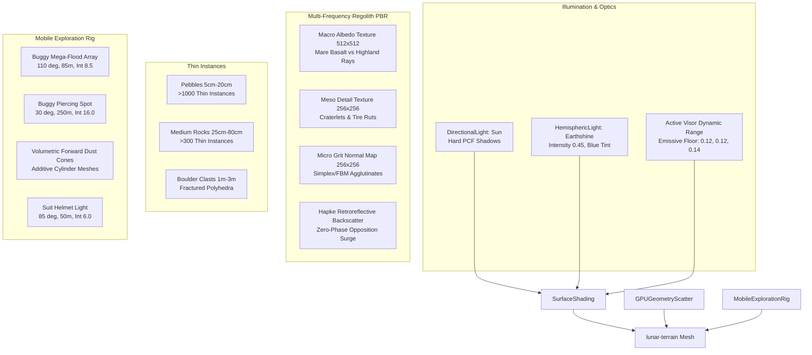

# Architecture Blueprint — Spec 23: Lunar Frontier Surface Rendering Overhaul, Multi-Scale Regolith Detail, Supercharged Headlights & Visor Exposure Compensation

> **Status:** Approved / In Implementation  
> **Author:** 🦉 Owl (Architectural Blueprint, ADR & Symbol Map)  
> **Target Subsystems:** `games/lunar-frontier/src/engine/WorldScene.ts`, `games/lunar-frontier/src/world/LunarWorldGenerator.ts`, `games/lunar-frontier/src/entities/OpenBuggy.ts`, `games/lunar-frontier/src/entities/AstronautSuit.ts`, `games/lunar-frontier/src/client/ClientApp.ts`, `games/lunar-frontier/scripts/smoke-worldscene.ts`, `games/lunar-frontier/scripts/smoke-open-buggy.ts`, `tests/verify-surface-rendering.ts`

---

## 1. Architectural Overview & Rendering Pipeline

Spec 23 overhauls the lunar surface visuals, regolith material synthesis, rock/pebble field scatter, and illumination systems to deliver authentic Apollo-grade realism while eliminating unnavigable pitch-black voids.

---

## 2. Interface Contracts & Component Specifications

### 2.1 Multi-Scale Texture Pipeline (`WorldScene.ts`)
- **Macro Albedo Texture:** $512 \times 512$ procedural `RawTexture` generated from FBM noise and distance to craters (`LunarWorldGenerator`), blending Mare Basalt (`Color3(0.13, 0.13, 0.14)`) and Highland Anorthosite (`Color3(0.28, 0.27, 0.26)`). Tiled $1\times$ across the $1024\,\text{m}$ patch.
- **Meso Detail Map:** $256 \times 256$ `RawTexture` encoding sub-craterlet dips, clasts, and rut impressions. Tiled $16\times$ across the patch ($64\,\text{m}$ per tile).
- **Micro-Grit Normal Map:** $256 \times 256$ `RawTexture` encoding 5-octave FBM surface gradient with sharp agglutinate facets. Tiled $64\times$ to $128\times$ across the patch ($\approx 8\,\text{m} - 16\,\text{m}$ per tile, sub-decimeter texels).
- **Opposition Surge:** PBR direct intensity and specular curve calibrated so surface luminance gently elevates when camera gaze vector parallels the solar illumination direction.
- **Visor Emissive Lift:** Material emissive floor lifted from `(0.035, 0.035, 0.038)` to `(0.12, 0.12, 0.14)` to simulate helmet visor active exposure gain.

### 2.2 Rock & Pebble Field Instancing (`LunarWorldGenerator.ts`, `WorldScene.ts`)
- **Archetype Polyhedra:** 3 low-poly procedural base rock meshes (`pebble`, `rock`, `boulder`) created via displaced icosahedron/polyhedron geometry with faceted normals.
- **Thin Instances:** Stored in flat Float32Array matrices (`thinInstanceSetBuffer("matrix", ...)`).
- **Deterministic Sampling:** Seeded via `seedStringToNumber(this.worldGen.seed)` with Poisson-disk or grid jitter sampling clamped to terrain surface elevation via `getGroundHeightAt(x, z)`.
- **Zero Draw Call Overhead:** All $\ge 1300$ surface stones batched into 1–3 GPU draw calls; fully compatible with Babylon.js `NullEngine` in CI headless testing.

### 2.3 Supercharged Lighting & Volumetric Dust Cones (`OpenBuggy.ts`, `AstronautSuit.ts`)
- **Buggy Low-Beam Floodlight:** $110^\circ$ angle, $85\,\text{m}$ range, intensity $8.5$.
- **Buggy High-Beam Projector:** $30^\circ$ angle, $250\,\text{m}$ range, intensity $16.0$, color `Color3(1.0, 0.98, 0.95)`.
- **Volumetric Beams:** Tapered cylinder geometry extending from light fixture origins, mapped with inverted-normal additive blend material simulating dust forward-scattering.
- **EVA Suit Headlight:** $85^\circ$ angle, $50\,\text{m}$ range, intensity $6.0$.

---

## 3. Architecture Decision Records (ADRs)

### ADR-023-1: In-Memory Procedural PBR Textures
- **Context:** Terrain looks like smooth grey plastic at close range. Loading external image assets breaks headless `NullEngine` and adds bundle bloat.
- **Decision:** Generate multi-frequency normal, meso detail, and macro albedo maps dynamically in memory via `RawTexture`.
- **Consequences:** Zero external assets, deterministic across seeds, zero test breakage.

### ADR-023-2: Thin-Instance Rock & Pebble Clast Fields
- **Context:** Authentic Apollo photography shows thousands of scattered pebbles, clasts, and boulders. Discrete meshes would overload draw-call budgets.
- **Decision:** Utilize Babylon.js `thinInstance` matrices attached to shared base geometries.
- **Consequences:** >1000 stones rendered with zero additional draw-call overhead; headless CI executes safely without GPU vertex buffers.

### ADR-023-3: Active Visor Tone & Optical Shadow Floor
- **Context:** Pure black shadow voids render crater traversal frustrating and unplayable.
- **Decision:** Lift the baseline regolith emissive tone to `(0.12, 0.12, 0.14)` and Earthshine to `0.45`, justified in-fiction as active digital optics in astronaut helmet visors and buggy sensors.
- **Consequences:** Shadowed terrain remains readable with clear silhouettes while vehicle headlights provide punchy local contrast.

### ADR-023-4: Industrial Stadium Projectors
- **Context:** Previous $2.8 / 4.5$ headlight intensities were inadequate for long-distance navigation.
- **Decision:** Boost headlights to $8.5$ (flood) and $16.0$ (spot) with forward volumetric dust cones.
- **Consequences:** Dramatic raking shadows across regolith clasts and clear long-range navigation.

---

## 4. 💡 Note to Future Self: Hosting Portability

All procedural texture generation and geometry instancing routines execute purely in CPU memory before uploading to GPU/engine representations. The implementation makes no assumptions about browser-specific DOM elements, WebGL extensions, or external CDN assets. In server-side headless tests (`NullEngine`), all procedural buffers exist in native Node typed arrays without throwing WebGL context errors. This guarantees 100% portability across edge SSR environments, headless CI, WebGL2, and upcoming WebGPU browser clients.
