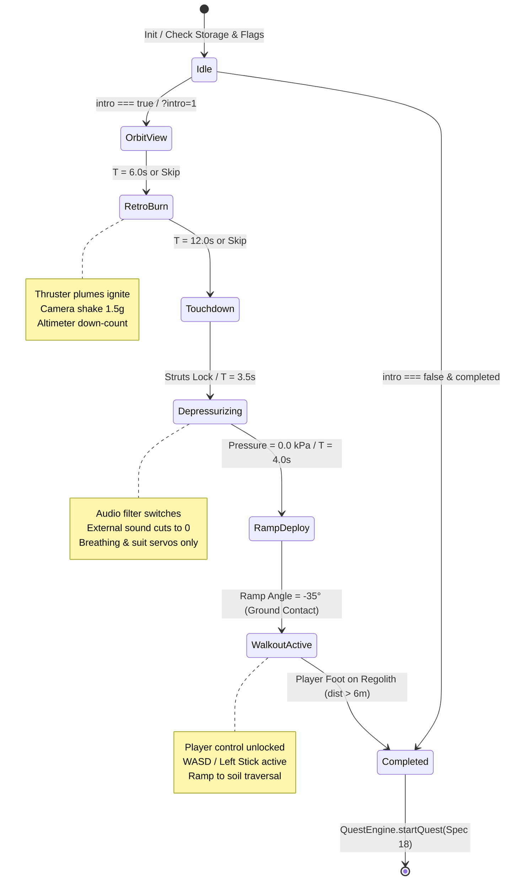

# Architectural Blueprint: Spec 24 — Transport Flight, Orbital Descent & First-Landing Experience

> **Companion Spec:** `specs/24-lunar-frontier-transport-flight-and-landing-experience.md`  
> **Target Subsystems:** `games/lunar-frontier/src/client/IntroDirector.ts`, `games/lunar-frontier/src/entities/TransportLander.ts`, `games/lunar-frontier/src/engine/CameraRig.ts`, `games/lunar-frontier/src/ui/LunarHUD.ts`, `games/lunar-frontier/src/client/ClientApp.ts`, `games/lunar-frontier/src/client/QuestEngine.ts`.

---

## 1. Architectural Overview & Component Topology

The First-Time Arrival Experience coordinates five subsystems inside `ClientApp`:
1. **`IntroDirector`**: Finite state machine governing timeline progression, event dispatches, camera spline sequencing, HUD overlays, and skip/replay inputs.
2. **`TransportLander`**: Procedural dropship entity owning the physical lander geometry, interior passenger compartment, hydraulic landing gear, animated stern cargo ramp, and retro-thruster illumination.
3. **`CameraRig`**: Multi-camera manager extended with interior cabin orientation (`intro_cabin`) and exterior tracking (`intro_cinematic`), blending smoothly into player first-person (`eva_first_person`).
4. **`LunarHUD`**: Glassmorphic DOM layer hosting flight telemetry (altitude, descent velocity, trajectory), hold-to-skip circular radial fill, corporate arrival transmission, and the replay control widget.
5. **`QuestEngine`**: Client quest state machine hooked into the moment player boots contact lunar regolith to initialize Spec 18 Stage 1.

```
┌─────────────────────────────────────────────────────────────────────────────┐
│                                 ClientApp                                   │
│                                                                             │
│   ┌─────────────────────────────────────────────────────────────────────┐   │
│   │                           IntroDirector                             │   │
│   │                                                                     │   │
│   │  • State Machine: orbit -> burn -> touchdown -> depress -> walkout  │   │
│   │  • Timecode & Transition Driver                                     │   │
│   │  • Replay, Fast-Forward & Hold-to-Skip Logic                        │   │
│   └──────┬──────────────┬──────────────┬──────────────┬─────────────┬───┘   │
│          │              │              │              │             │       │
│          ▼              ▼              ▼              ▼             ▼       │
│   ┌──────────────┐┌──────────────┐┌───────────┐┌─────────────┐┌─────────┐   │
│   │Transport     ││CameraRig     ││LunarHUD   ││QuestEngine  ││Audio/FX │   │
│   │Lander        ││              ││           ││             ││Pipeline │   │
│   │              ││• intro_cabin ││• Vector   ││• Bridge on  ││• Vacuum │   │
│   │• Hull & Gear ││• intro_cine  ││  Altimeter││  Regolith   ││  Ejecta │   │
│   │• Cargo Ramp  ││• eva_first_  ││• Skip Bar ││  Contact    ││• Suit   │   │
│   │• Thrusters   ││  person      ││• Replay UI││• Stage 1    ││  Acoustic│  │
│   └──────────────┘└──────────────┘└───────────┘└─────────────┘└─────────┘   │
└─────────────────────────────────────────────────────────────────────────────┘
```

---

## 2. Finite State Machine & Timeline Event Flow



---

## 3. Data Structures & Subsystem Interfaces

### 3.1 `IntroDirector` State & Options Interface
```typescript
export type IntroPhase =
  | 'idle'
  | 'orbit'
  | 'burn'
  | 'touchdown'
  | 'depressurize'
  | 'ramp'
  | 'walkout'
  | 'completed';

export interface IntroDirectorConfig {
  /** Target world coordinate of the landing site (default origin). */
  landingCoordinate: { x: number; y: number; z: number };
  /** Heading angle of the lander in radians (default 0). */
  landerHeadingRad?: number;
  /** Custom time scale multiplier (default 1.0). */
  timeScale?: number;
  /** Storage interface for persistence (defaults to localStorage). */
  storage?: Storage;
}

export interface IntroTelemetry {
  phase: IntroPhase;
  phaseElapsedSeconds: number;
  altitudeMeters: number;
  descentVelocityMps: number;
  cabinPressureKPa: number;
  skipHoldProgress: number; // 0.0 to 1.0
}
```

### 3.2 `TransportLander` Hierarchy
```
rootNode (TransformNode)
  ├── hullBodyMesh (Cylinder/Octagon - PBR Metallic 0.8, Roughness 0.3)
  ├── cockpitViewportMesh (Translucent Glass + Emissive Vector Trim)
  ├── landingLegs [4] (Piston Rods + Cylinders + Footpads)
  ├── engineClusters [4] (Thruster Bells + Emissive Throat)
  │     └── thrusterLights [4] (Dynamic PointLights)
  └── rampHingeNode (TransformNode - Pivot at Stern Floor Datum)
        ├── rampSlabMesh (Ribbed Metal Grating)
        └── rampRailings [2] (Safety Tubes)
```

---

## 4. Audio-Visual Transformation: The Vacuum Acoustic Shift

One of the defining sensory features is the abrupt acoustic change during Beat 4 (`depressurize`):

| Acoustic Channel | Cabin Atmosphere (Beats 1–3) | Lunar Vacuum (Beats 4–6) |
| :--- | :--- | :--- |
| **Environmental Ambience** | Ship hum, airflow fans, turbine vibration ($40\text{--}18000\,\text{Hz}$). | **Silent (0 dB).** Vacuum conducts no sound waves. |
| **Footsteps & Mechanics** | Reverberant metal footfalls, open air echoes. | Bone-conducted, low-pass filtered muffled thump ($<250\,\text{Hz}$). |
| **Life Support** | Distant background indicator. | Prominent, rhythmic suit helmet breathing and internal regulator valve clicks. |
| **Radio Comms** | Open cabin loudspeaker. | Scratchy, band-limited radio burst directly into helmet speakers with sidetone static. |

---

## 5. Replay, Testing & Debug Protocols

### 5.1 Storage Isolation & Keys
- Storage key: `lunar_frontier_intro_completed` (`'1'` or absent).
- When `ClientApp` initializes:
  ```typescript
  const params = new URLSearchParams(window.location.search);
  const forceIntro = params.get('intro') === '1';
  const skipIntro = params.get('skip_intro') === '1' || params.get('intro') === '0';
  const alreadyCompleted = localStorage.getItem('lunar_frontier_intro_completed') === '1';

  if (!skipIntro && (forceIntro || !alreadyCompleted)) {
    this.introDirector.start(params.get('intro_phase') as IntroPhase ?? 'orbit');
  } else {
    this.spawnPlayerDirectly();
  }
  ```

### 5.2 Clean Teardown & Reset Guarantee
Calling `introDirector.reset()`:
1. Stops all running animation tweens and camera interpolations.
2. Clears particle systems (`ejectaEmitter.stop()`).
3. Closes lander ramp (`setRampDeployment(0)`).
4. Teleports player avatar back to cabin jump-seat spawn.
5. Emits `PHASE_CHANGED` (`'orbit'`) and resumes director.

---

## 6. Verification Harness Architecture (`smoke-intro-experience.ts`)

Headless execution via `NullEngine`:
1. **State Machine Integrity:** Evaluates progression across all 7 states (`orbit` $\to$ `burn` $\to$ `touchdown` $\to$ `depressurize` $\to$ `ramp` $\to$ `walkout` $\to$ `completed`).
2. **Hold-to-Skip Assertions:** Simulates 1200ms hold input, asserting immediate phase skip and event firing.
3. **Phase Jump Directness:** Asserts direct initialization from arbitrary phase query inputs (e.g. `start('touchdown')`).
4. **Replay Teardown:** Runs full sequence $\to$ completes $\to$ triggers `reset()` $\to$ asserts zero dangling meshes, zero NaN transform matrices, and fresh phase state.
