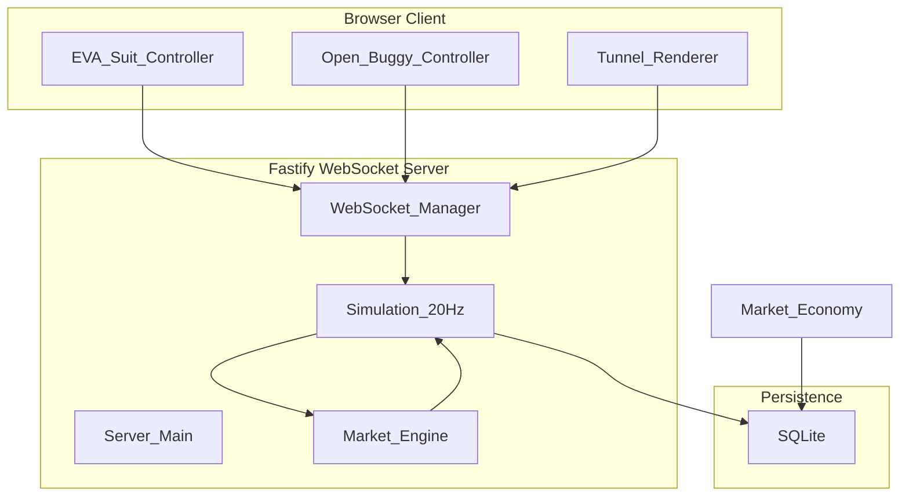

# Lunar Frontier

This is a multi-agent orchestration of a persistent economy and multiplayer simulation running in the browser with a Fastify backend, WebSocket server, and SQLite persistence.

## Overview

A persistent lunar economy and multiplayer simulation with:

1. **Babylon.js 3D engine** client
2. **Fastify + WebSocket** server
3. **SQLite** database
4. **EVA suit + buggy** vehicles and entities

## Architecture

## Directories

### `/src`
- `entities/` - EVA suit controller, buggy, and vehicle
- `engine/` - 3D rendering engine (Babylon.js)
- `server/` - Fastify WebSocket server

### `/docs`
- Architecture
- Deployment
- API

### `/specs`
- Design specs
- ADRs