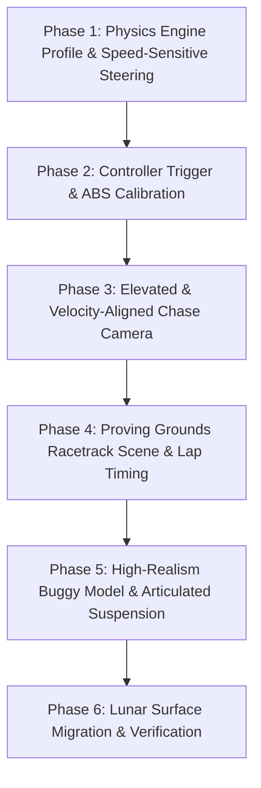

# Spec 17: Lunar Frontier — Terrestrial Proving Grounds Racetrack, Driving Simulation Refinement & Visual Fidelity Overhaul

> **Target Systems:** `ProvingGroundsScene.ts` (new), `TraversalPhysics.ts`, `OpenBuggy.ts`, `CameraRig.ts`, `ClientApp.ts`, `LunarHUD.ts`.  
> **Platforms:** WebGL2/WebGPU Desktop (Chrome/Firefox), Steam Deck & Handhelds (GPD Win Max 2, standard Gamepad API).  
> **Preceding Specs:** Spec 12 (Lunar Frontier Architecture), Spec 14 (Controls & Navigation), Spec 15 (Unified Kinematics & Stability), Spec 16 (Dramatic Rover Experience).

---

## 1. Executive Summary & Core Motivation

Dogfooding and driving trials in Lunar Frontier revealed a fundamental simulation challenge:
Attempting to tune vehicle handling directly on low-gravity, cratered regolith conflates **suspension oscillation**, **ballistic low-g launches**, **loose regolith slip**, and **core powertrain/steering response**. When a vehicle spins out or wanders off line, it is nearly impossible to tell whether the root cause is poor steering rate curves, inadequate lateral tire grip, excessive throttle sensitivity, or lunar terrain bumps.

To achieve the **"best driving simulation ever"**, we must decouple chassis dynamics and control feel from lunar topography:
1. **Terrestrial Proving Grounds Simulation Environment:**
   - Create an isolated, dedicated simulation environment (`ProvingGroundsScene.ts` / Proving Grounds mode) featuring an asphalt and compacted-gravel test circuit / racetrack on Earth gravity ($g = 9.81\,\text{m/s}^2$) with zero lunar dust bounce.
   - The racetrack features banked turns, sweeping chicanes, hairpin bends, slalom sections, straightaway speed traps, and elevation undulations designed specifically to benchmark acceleration, braking distance, turn-in authority, understeer/oversteer balance, and lateral slip transition.
2. **First-Class Game Controller Driving UX:**
   - Analog trigger acceleration with true progressive torque mapping (anti-jerk filter + quadratic throttle response).
   - Left analog stick steering with dynamic speed-sensitive lock reduction (high authority at low speeds, stable directional stability at top speeds) and exponential sensitivity curves.
   - Dual-stage progressive service braking (analog left trigger) with anti-lock braking system (ABS) modulation and emergency handbrake toggle.
   - Haptic vibration feedback (DualShock / Xbox rumble motor API via `GamepadHapticActuator`) on tire slip, redline throttle, curb rumble, and hard braking.
3. **Elevated & Cinematic Chase Camera ("Above and Behind"):**
   - High-attitude elevated chase camera: $3.8\,\text{m}$ height offset, $8.5\,\text{m}$ follow distance, slightly downward pitch ($-16^\circ$ to $-22^\circ$) looking over the hood and chassis to clearly reveal upcoming road apexes and vehicle slip angle.
   - Dynamic velocity-vector lookahead: camera pivots gently toward the vehicle's actual velocity vector rather than purely rigid chassis yaw, allowing the driver to naturally counter-steer drifts and perceive lateral traction breakaways.
   - Speed-dependent field of view ($60^\circ \to 78^\circ$) with subtle chassis vibration damping.
4. **Visual Realism & Buggy Model Overhaul:**
   - Procedural or high-fidelity geometric upgrades to the buggy: true tubular space-frame roll cage, double-wishbone A-arm suspension geometry with visible coilover spring/damper assemblies, high-detail wire-mesh/tread tires with rim spokes, battery cooling radiators, steering rack tie-rods that physically turn with the wheels, and realistic PBR metallic/matte coatings.
5. **Seamless Lunar Migration Path:**
   - Parameterized physics presets (`Preset: Earth Proving Grounds` vs `Preset: Lunar Frontier Surface`).
   - Once the driving feel achieves an amazingly positive rating on the track, the calibrated response curves, tire friction ellipse, and steering damping are migrated to the lunar surface with appropriate lunar gravity ($1.62\,\text{m/s}^2$) and low-g regolith traction adjustments.

---

## 2. Mathematical & Mechanical Specifications

### 2.1 Two-Tier Physics Environment (`TraversalPhysics.ts`)
Introduce an explicit gravity and surface material configuration into `BuggyOptions`:

```typescript
export interface EnvironmentProfile {
  name: 'earth_proving_grounds' | 'lunar_frontier';
  gravity: number;             // Earth: 9.81 m/s², Moon: 1.62 m/s²
  surfaceFrictionMu: number;   // Asphalt: 1.05, Gravel: 0.85, Regolith: 0.68
  airResistanceCdA: number;    // Aerodynamic drag area (0.45 m² Earth, 0.00 m² Moon vacuum)
  tireRollingResistance: number; // 0.015 asphalt, 0.040 loose soil
}

export const ENV_EARTH_PROVING_GROUNDS: EnvironmentProfile = {
  name: 'earth_proving_grounds',
  gravity: 9.81,
  surfaceFrictionMu: 1.05,
  airResistanceCdA: 0.45,
  tireRollingResistance: 0.015,
};

export const ENV_LUNAR_FRONTIER: EnvironmentProfile = {
  name: 'lunar_frontier',
  gravity: 1.62,
  surfaceFrictionMu: 0.68,
  airResistanceCdA: 0.0,
  tireRollingResistance: 0.035,
};
```

### 2.2 Directional Control & Speed-Sensitive Steering Dynamics
To solve "far too difficult to control and keep moving in the intended direction":
1. **Speed-Sensitive Steering Lock Angle:**
   At low speeds, maximum steering lock is large ($45^\circ \approx 0.785\,\text{rad}$) for tight turnaround maneuvers. At high speeds ($v \ge 25\,\text{m/s}$), steering lock smoothly diminishes to prevent catastrophic spinouts:
   $$\delta_{\text{max}}(v) = \delta_{\text{high}} + (\delta_{\text{low}} - \delta_{\text{high}}) \cdot \frac{1}{1 + (v / v_{\text{steer\_half}})^2}$$
   Where $\delta_{\text{low}} = 45^\circ$, $\delta_{\text{high}} = 14^\circ$, and $v_{\text{steer\_half}} = 10\,\text{m/s}$.
2. **Exponential Analog Stick Curve & Centering Torque:**
   $$u_{\text{steer}} = \text{sign}(x_{\text{axis}}) \cdot \left(\frac{|x_{\text{axis}}| - \text{deadzone}}{1 - \text{deadzone}}\right)^{\gamma_{\text{steer}}}$$
   With $\gamma_{\text{steer}} = 1.6$ and deadzone $= 0.12$.
   Active high-speed centering rate pushes steering back to zero when stick is released at a rate proportional to $v^2$.
3. **Pacejka Lateral Slip & Understeer Gradient:**
   Tire lateral cornering force follows a normalized brush tire model:
   $$F_{y, i} = -\mu \cdot F_{z, i} \cdot \sin\left(C \cdot \arctan\left(B \cdot \alpha_i\right)\right)$$
   Where slip angle $\alpha_i = \arctan\left(\frac{v_{y, i}}{|v_{x, i}| + 0.1}\right) - \delta_i$.
   Rear tires are tuned with slightly higher lateral stiffness ($C \cdot B$) than front tires to yield progressive, predictable understeer rather than snap-oversteer.

### 2.3 Throttle & Braking Progression
1. **Analog Trigger Mapping:**
   $$T_{\text{throttle}} = (R_2)^{\gamma_{\text{throttle}}} \cdot T_{\text{max}}, \quad \gamma_{\text{throttle}} = 1.4$$
   Eliminates sudden wheelspin on launch while providing instant full torque when mashed.
2. **Anti-Lock Braking (ABS) & Brake Bias:**
   $$F_{\text{brake, front}} = 0.62 \cdot F_{\text{brake, total}}, \quad F_{\text{brake, rear}} = 0.38 \cdot F_{\text{brake, total}}$$
   Wheel slip ratio $s_i = \frac{R_{\text{wheel}} \cdot \omega_i - v_x}{\max(v_x, 0.1)}$. If $s_i < -0.25$, brake torque on wheel $i$ is pulsed at $15\,\text{Hz}$ to retain steering authority under hard emergency braking.

### 2.4 High-Attitude Chase Camera: "Above and Behind"
1. **Pose Geometry:**
   - Distance: $8.5\,\text{m}$ behind chassis datum.
   - Height Offset: $3.8\,\text{m}$ above chassis datum.
   - Pitch Angle: $-18^\circ$ downward incline towards the vehicle hood, framing the horizon and upcoming turns in the upper third of the viewport.
2. **Velocity Vector Lookahead (Drift Tracking):**
   Instead of tracking purely vehicle yaw $\theta_{\text{body}}$, target camera azimuth blends toward travel direction:
   $$\theta_{\text{look}} = \theta_{\text{body}} + \beta \cdot \text{atan2}(v_y, v_x)$$
   Where $\beta = 0.35$ for $|v| > 2.0\,\text{m/s}$.
   This provides the intuitive, satisfying driving feel of seeing the car rotate into drifts while keeping the road ahead clearly centered.

---

## 3. Racetrack Proving Grounds Architecture

### 3.1 Procedural Circuit Geometry (`ProvingGroundsScene.ts`)
The Proving Grounds track is a continuous closed-circuit asphalt ribbon with:
1. **Dimensions:**
   - Width: $12\,\text{m}$ track width with distinct curbs ($1.5\,\text{m}$ red/white striped rumble strips) and painted centerline/edge markings.
   - Total Length: $\approx 1,200\,\text{m}$ loop.
2. **Circuit Sections:**
   - **Section 1 (Straightaway Speed Trap):** $250\,\text{m}$ flat straight to measure $0 \to 100\,\text{km/h}$ acceleration, brake stopping distance, and top-end stability.
   - **Section 2 (Banked High-Speed Sweeper):** $180^\circ$ radius $75\,\text{m}$ curve banked inwards at $10^\circ$ to evaluate centrifugal grip and suspension compression.
   - **Section 3 (Slalom S-Curves):** Three consecutive alternating $30\,\text{m}$ radius transitions to tune steering latency, body roll damping, and weight transfer.
   - **Section 4 (Hairpin & Agility Zone):** Tight $15\,\text{m}$ radius $180^\circ$ turn with run-off tarmac to test low-speed torque vectoring, handbrake turns, and low-speed steering lock.
   - **Section 5 (Camber & Elevation Crest):** $5\,\text{m}$ elevation rise with crest compression to test suspension rebound damping and pitch stability.
3. **Surface Markings & Waypoint Spline:**
   - Segmented checkpoint system recording lap times, sector splits (Sector 1, Sector 2, Sector 3), and speed traps.

---

## 4. Vehicle 3D Visual Realism Overhaul (`OpenBuggy.ts`)

Upgrade the procedural buggy mesh hierarchy to look mechanical, realistic, and purposeful:
1. **Chassis & Space-Frame:**
   - Tubular roll cage structure with cross-bracing and chamfered structural tubing.
   - Underbody skid plate and reinforced front bumper / winch bar.
2. **Articulated Suspension & Steering:**
   - Lower and upper A-arms (wishbones) connected to wheel uprights.
   - Coaxial coilover spring and damper cylinder with visible coiled spring geometry.
   - Tie-rod assemblies steering front wheels in real time with steering input $\delta$.
3. **Cockpit & Details:**
   - Ergonomic high-backed racing bucket seats with 4-point harness straps.
   - Digital telemetry dash display with speed, gear/direction, and g-force meter.
   - Realistic twin LED lightbars with volumetric lens flare and front light cones.
4. **Materials & Shading:**
   - PBR metallic rough materials: powder-coated steel tubes, carbon-fiber textured bed panels, matte rubber tires, and polished suspension stanchions.

---

## 5. Migration Strategy to Lunar Surface

1. **Step A:** Refine steering curves, trigger acceleration, ABS, and camera in the Proving Grounds environment until lap times are consistent, zero uncontrolled spinouts occur, and the controller feel is validated as exceptionally satisfying.
2. **Step B:** Export the tuned control mappings (speed-sensitive steering lock, exponential input filters, velocity-vector camera lookahead).
3. **Step C:** Apply the tuned control stack to `TraversalPhysics.ts` under lunar mode:
   - Adjust suspension spring rates ($k_s$) and damping ($c_d$) for $1.62\,\text{m/s}^2$ lunar gravity.
   - Retain the same refined steering curve and camera rig, eliminating the floaty, uncontrollable behavior on the Moon.

---

## 6. Implementation Phases & Task Decomposition



| Phase | Milestone Name | Key Files | Deliverables |
| :--- | :--- | :--- | :--- |
| **Phase 1** | **Physics Environment & Steering Dynamics** | `TraversalPhysics.ts` | Speed-dependent steering lock, exponential input curves, Earth gravity profile, Pacejka understeer tuning. |
| **Phase 2** | **Controller UX & Analog Calibration** | `ClientApp.ts`, `TraversalPhysics.ts` | Quadratic trigger throttle mapping, ABS modulation, brake bias, gamepad vibration haptics. |
| **Phase 3** | **Elevated Cinematic Chase Camera** | `CameraRig.ts` | High-attitude above-and-behind framing ($3.8\,\text{m}$ height, $8.5\,\text{m}$ dist), velocity vector lookahead, drift tracking. |
| **Phase 4** | **Proving Grounds Racetrack Environment** | `ProvingGroundsScene.ts`, `ClientApp.ts`, `LunarHUD.ts` | Banked turns, slalom, speed trap, asphalt PBR shader, checkpoint lap timing HUD. |
| **Phase 5** | **Buggy Visual Realism Overhaul** | `OpenBuggy.ts` | Tubular space-frame cage, A-arm suspension, coilover springs, steering tie-rods, racing cockpit, PBR finishes. |
| **Phase 6** | **Lunar Migration & Headless Verification** | `ClientApp.ts`, `smoke-proving-grounds.ts`, `verify-driving-sim.ts` | Lunar parameter adaptation, mode switching (`Earth Track` vs `Lunar Surface`), 100% automated test coverage. |

---

## 7. Verification & Acceptance Gate

1. **Deterministic Driving Metric:**
   - High-speed slalom test at $20\,\text{m/s}$ completes with zero uncontrolled spinouts.
   - Emergency braking from $25\,\text{m/s}$ stops in $< 18\,\text{m}$ on asphalt with maintained lateral steering authority.
   - Low-speed turnaround ($180^\circ$) executes in $< 2.2\,\text{s}$ within a $3.5\,\text{m}$ radius.
2. **Camera UX:**
   - Zero jarring camera clipping; road apex remains framed in the field of view during high-speed drifts.
3. **Visual Realism:**
   - Wheels physically steer and articulate over curbs with visible spring compression and tie-rod movement.
4. **Test Suite:**
   - Headless test suite `npm run test` or `npx tsx tests/verify-driving-sim.ts` executes and passes cleanly with 0 failures.
