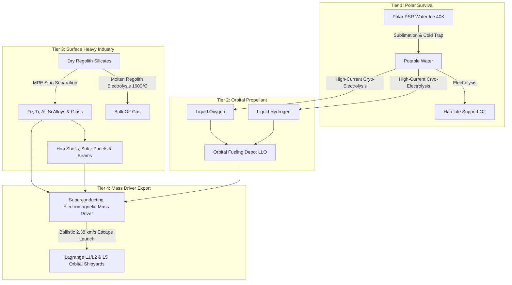
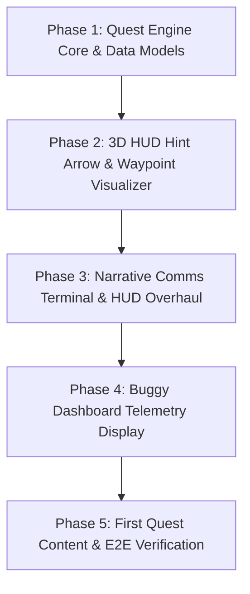

# Spec 18: Lunar Frontier — New Player UX, Narrative Quest Framework & Tiered Resource Progression

> **Target Systems:** `games/lunar-frontier/src/ui/LunarHUD.ts`, `games/lunar-frontier/src/ui/hud.css`, `games/lunar-frontier/src/client/ClientApp.ts`, `games/lunar-frontier/src/client/QuestEngine.ts` (new), `games/lunar-frontier/src/engine/WorldScene.ts`, `games/lunar-frontier/src/entities/OpenBuggy.ts`.  
> **Platforms:** WebGL2/WebGPU Desktop (Chrome/Firefox), Steam Deck & Handhelds (GPD Win Max 2, Gamepad API).  
> **Preceding Specs:** Spec 12 (Multiplayer & Economy), Spec 14 (UX & Onboarding Checklist), Spec 15/16/17 (Rover Kinematics, Navigation & Driving Simulation).

---

## 1. Executive Summary & Problem Statement

Initial player testing of *Lunar Frontier* revealed that while the static 5-step checklist (Spec 14 §3.5) tracks basic mechanics, it fails to engage new players emotionally or guide them spatially:
1. **Lacks Narrative Context:** The player spawns into a vacuum wasteland with no identity, stakes, or lore explaining *why* they are on the Moon, who employs them, or what their long-term purpose is.
2. **Ambiguous Spatial Direction:** Players are told to "Locate Mineral Deposit", but the top compass tape icon is easy to miss when panning across blinding white terrain. Without an intuitive 3D directional hint arrow and contextual distance readout, new players wander aimlessly into barren crater fields.
3. **Mechanical Disconnect:** The checklist feels like an engineering unit test rather than an immersive space-colonization loop.

Spec 18 transforms new player onboarding into an **episodic, story-driven Quest Framework** paired with **3D spatial navigation hint arrows** and **in-cockpit buggy dashboard integration**. It formally establishes the 4-tier scientific lunar industrial loop—anchoring gameplay from immediate Tier 1 survival up to Tier 4 electromagnetic orbital mass drivers.

---

## 2. World Lore & Narrative Foundations

### 2.1 The "Wild West" Lunar Gold Rush
> *"The Moon is open for business, and it's a land-grab unlike any since the 1850s. And this is definitely the wild west. You have been down on your luck for a few years and found yourself without enough cash to buy your next bottle, so you signed up as a contractor with a one-way ticket. You have been hired by <Corp Name> to get in on the action. There are a mix of nation-states and scrappy private outfits vying for control; you're definitely part of the latter. They don't even give you very good intel on what to do. The goal: establish a base, expand it by any means necessary, and don't get caught doing anything terrible."*

### 2.2 Contractor Factions & Corporate Backers
The player is assigned to or signs with a corporate syndicate operating out of unpatrolled frontier sectors:
- **Caelus Extraction Corp (CEC):** Aggressive, profit-driven wildcatters prioritizing speed over safety.
- **Mare Crisium Consortium:** Scrappy independent cooperative operating salvaged heavy machinery.
- **Artemis Mining Syndicate:** Former state contractors turned private prospectors, heavy on bureaucratic jargon and high-spec gear.

Incoming narrative comms from corporate dispatchers appear in the HUD as encrypted low-bandwidth burst transmissions with scratchy audio telemetry pings and CRT scanline effects.

---

## 3. The 4-Tier Realistic Lunar Industrial Loop

The overarching game design grounds all progression in real lunar physics, geology, and orbital mechanics across four interconnected tiers:



### 3.1 Pillar 1: Water & Volatiles in Permanently Shadowed Regions (PSRs)
- **The Resource:** Subsurface regolith mixed with water ice (5% to 10%+ by weight) alongside trapped $\text{CO}_2$, $\text{CH}_4$, $\text{NH}_3$, and sulfur compounds trapped inside perpetual 40 K ($-233^\circ\text{C}$) cold traps (e.g. Shackleton, Cabeus).
- **Extraction:** Solar concentrator mirrors deployed along crater rims reflecting sunlight into crater bottoms, or thermal sublimation domes with cryo-condensers.
- **Utility:** Life support (drinking water, breathing $\text{O}_2$) and baseline rocket propellant ($\text{LH}_2/\text{LOX}$).
- **Friction/Bottleneck:** Pitch-black darkness, extreme cryo-temperatures, steep 35° crater walls, and abrasive icy dust.

### 3.2 Pillar 2: Regolith-Derived Oxygen & Structural Metals
- **The Resource:** Equatorial and mid-latitude dry regolith—40% to 45% $\text{O}_2$ by weight locked chemically in ilmenite ($\text{FeTiO}_3$), anorthite, and pyroxene.
- **Extraction:** Molten Regolith Electrolysis (MRE) or carbothermal reduction heating rock to $\approx 1600^\circ\text{C}$ with direct electric current.
- **Utility:** Bulk oxygen without polar water depletion; byproduct slag metals (iron, titanium, aluminum, silicon) for 3D-printing habitats, truss structures, and solar panels.
- **Friction/Bottleneck:** Massive electrical and thermal power draw; severe equipment wear from sharp, un-weathered regolith dust particles grinding joint seals.

### 3.3 Pillar 3: Kinetic Export & Orbital Mass Drivers
- **The Physics:** Modest lunar escape velocity ($v_{\text{esc}} = \sqrt{2 G M / R} \approx 2.38\,\text{km/s}$) and zero atmospheric drag make kinetic launches exponentially cheaper than rocket launches.
- **The Hardware:**
  1. *Superconducting Electromagnetic Mass Driver (Coilgun/Railgun):* Multi-kilometer ground track accelerating automated payload buckets to $2.38\,\text{km/s}$, releasing refined metal ingots, propellant pods, and volatile canisters into ballistic transfer orbits toward Earth-Moon Lagrange points ($L_1 / L_2$) or Low Lunar Orbit (LLO).
  2. *Momentum Exchange Tethers (Rotovators):* Rotating orbital tethers skimming low periapsis to snatch surface payloads without expending chemical fuel.
- **Utility:** Supplies orbital shipyards, cis-lunar transfer stations, and L5 space colonies.
- **Friction/Bottleneck:** High peak capacitor power storage requirements, tight launch telemetry timing, fixed orbital launch windows, and structural wear on accelerator tracks.

---

## 4. Quest Framework Architecture (`QuestEngine.ts`)

### 4.1 Data Models & Interfaces

```typescript
export type QuestId = string;
export type ObjectiveType = 
  | 'move_distance' 
  | 'reach_target' 
  | 'extract_mineral' 
  | 'board_buggy' 
  | 'drive_distance' 
  | 'trade_commodity' 
  | 'build_structure';

export interface QuestObjective {
  id: string;
  description: string;
  type: ObjectiveType;
  targetCount: number;
  currentCount: number;
  completed: boolean;
  targetPosition?: { x: number; y: number; z: number };
  targetEntityId?: string;
}

export interface CommsDialogue {
  sender: string;
  callsign: string;
  transmission: string;
  audioTone?: 'burst' | 'alert' | 'success' | 'static';
  autoDismissMs?: number;
}

export interface QuestStage {
  stageNumber: number;
  stageTitle: string;
  storyNarration: CommsDialogue;
  objectives: QuestObjective[];
  hintArrowTarget?: { x: number; y: number; z: number; label: string };
}

export interface Quest {
  id: QuestId;
  title: string;
  faction: string;
  category: 'tutorial' | 'survival' | 'industry' | 'export';
  stages: QuestStage[];
  currentStageIndex: number;
  isCompleted: boolean;
  rewardCredits: number;
  rewardXp: number;
}
```

### 4.2 Quest Progression State Machine
The `QuestEngine` evaluates world events on each 60Hz tick or on discrete client events:
- Dispatches `QUEST_STAGE_ADVANCED`, `OBJECTIVE_UPDATED`, and `QUEST_COMPLETED` events across the client event bus.
- Persists progress to `localStorage` (`lunar_frontier_quest_progress`) to retain state across page refreshes.
- Automatically computes the active objective's world-space vector for the **3D Hint Arrow System**.

---

## 5. First Tutorial Quest: "A One-Way Ticket to the Frontier"

The opening quest seamlessly weaves basic controls and interface tutorials into corporate lore and the Tier 1 resource loop:

### Stage 1: Boots on the Ground (Locomotion & Life Support)
- **Narrative Comms:**  
  *Disp: "Contractor 7-Echo, wake up. Life support telemetry verified. Transport dropped you at the perimeter. Check your helmet seals and move 10 meters toward the survey beacon. Don't touch the visor seals unless you fancy suffocating."*
- **Objective:** Move 10m using `[W,A,S,D]` / Left Stick, execute a low-g leap with `[Space]` / Gamepad `(A)`.
- **Hint Arrow:** Points directly to the landing perimeter marker beacon.

### Stage 2: Scanner Calibration & Mineral Prospecting
- **Narrative Comms:**  
  *Disp: "Surface scan shows a rich outcrop of regolith rich in ilmenite 45 meters ahead. Look for the HUD indicator. Corporate wants a baseline spectrometer read before you start digging."*
- **Objective:** Approach within 6 meters of the designated mineral vein.
- **Hint Arrow:** Projected in 3D over the terrain surface, tracking the exact coordinates of the nearest mineral outcrop with distance readout (`45m... 20m... 5m`).

### Stage 3: Surface Extraction & Ilmenite Harvesting
- **Narrative Comms:**  
  *Disp: "That's high-grade silicate right there. 45% oxygen by weight, with enough titanium to build a small refinery if you melt it hot enough. Fire up your mining laser with [M] and extract at least 20 kg."*
- **Objective:** Hold `[M]` / Gamepad `(X)` near the vein to mine 20 kg of Regolith.
- **Hint Arrow:** Concentric pulsing reticle over the mining target.

### Stage 4: Vehicle Requisition & Cockpit Familiarization
- **Narrative Comms:**  
  *Disp: "Manual hauling will burn your O2 in ten minutes flat. We left a battered LRV buggy parked on the ridge. Head to the waypoint, mount the chassis with [E], and turn the dash on."*
- **Objective:** Approach the rover and press `[E]` / Gamepad `(Y)` to mount the driver's seat.
- **Hint Arrow:** Elevated waypoint beacon over the buggy cockpit.
- **Dashboard Telemetry:** The buggy dash display switches on, displaying contractor ID, corporation insignia, cargo hold capacity, and compass heading.

### Stage 5: The First Haul & Frontier Exchange
- **Narrative Comms:**  
  *Disp: "Good, you didn't roll it. Haul that payload back to the sector trade hub. Hit [T] at the terminal to dump your haul for cold hard scrip. Welcome to the Moon, contractor."*
- **Objective:** Drive buggy to the Faction Exchange Terminal and execute a trade with `[T]`.
- **Reward:** 500 Credits, Tier 1 Survival Tech Blueprint (Solar Condenser Stash).

---

## 6. Visual Presentation & HUD Architecture

### 6.1 3D Dynamic Hint Arrow (`HintArrowSystem.ts`)
1. **World-Space Projection & Screen-Edge Clamping:**
   - If the target is within the camera view frustum, render a 3D animated holographic neon chevron above the target, bobbing gently ($\pm 0.3\,\text{m}$, $1.2\,\text{Hz}$) with distance readout.
   - If the target is behind the camera or off-screen, clamp a directional navigation arrow to the perimeter of the screen viewport pointing toward the off-screen vector.
2. **Terrain-Conforming Ground Trail (Optional/Toggleable):**
   - Subtle glowing light spline on the regolith showing the navigable path over low-slope terrain.

### 6.2 Narrative Comms Terminal (HUD Left-Center)
- A glassmorphic terminal panel displaying incoming corporate comms.
- Features typing sound effect / audio chirp, dispatcher portrait/avatar wireframe, and audio burst wave indicator.
- Automatically collapses or dims after completion of the message, accessible via comms log key `[L]`.

### 6.3 Buggy Dashboard Telemetry Display (`OpenBuggy.ts`)
- In vehicle chase or first-person driving camera, the central dashboard LCD screen dynamically mirrors:
  1. Active Quest Title & Current Objective.
  2. Compass bearing & 3D arrow to active destination.
  3. Cargo capacity meter (e.g. `20/200 kg Regolith`).
  4. Contractor Corporation Logo & Radio Link Status (`ONLINE - 128 kbps`).

---

## 7. Implementation Phases & Task Decomposition



| Phase | Milestone Name | Key Files | Deliverables |
| :--- | :--- | :--- | :--- |
| **Phase 1** | **Quest Engine Core & State Machine** | `QuestEngine.ts`, `ClientApp.ts` | Quest schema, stage advancement logic, objective event triggers, `localStorage` persistence. |
| **Phase 2** | **3D Hint Arrow & Spatial Navigation** | `WorldScene.ts`, `CameraRig.ts`, `LunarHUD.ts` | Frustum-aware 3D waypoint arrow, off-screen edge clamp, distance indicator, target raycast. |
| **Phase 3** | **Narrative Comms Terminal & HUD Polish** | `LunarHUD.ts`, `hud.css` | Radio burst transmission UI, typewriter text animation, contractor corporate branding, audio pings. |
| **Phase 4** | **Buggy Dashboard HUD Integration** | `OpenBuggy.ts`, `ClientApp.ts` | Dynamic texture or 3D UI plane on buggy dash showing quest objective, nav vector, and cargo status. |
| **Phase 5** | **Tutorial Quest Implementation & Tests** | `QuestEngine.ts`, `ClientApp.ts`, `smoke-quest-engine.ts` | Complete 5-stage "A One-Way Ticket" quest, full gamepad/keyboard integration, automated headless test suite. |

---

## 8. Verification & Acceptance Criteria

1. **New Player Onboarding Flow:**
   - A fresh client session starts with zero manual configuration and immediately receives corporate dispatch dialogue.
   - Objective text clearly states the exact action and button mapping (e.g. "Move 10m [WASD / Left Stick]").
2. **Spatial Guidance & Hint Arrows:**
   - At all times during the tutorial, a clear 3D hint arrow points toward the active objective.
   - When panning 180° away from the target, the arrow cleanly clamps to the screen border pointing toward the off-screen target.
3. **Buggy Dashboard Integration:**
   - Entering the buggy updates the dashboard display with current quest coordinates and cargo inventory.
4. **Automated Headless Test Suite:**
   - `npm run test` or `npx tsx tests/smoke-quest-engine.ts` passes with 100% assertions satisfied (state transitions, persistence, objective evaluation).
5. **No Regressions:**
   - Existing driving physics (Spec 17), trading terminal (Spec 12/13), and multiplayer state replication remain fully intact.
