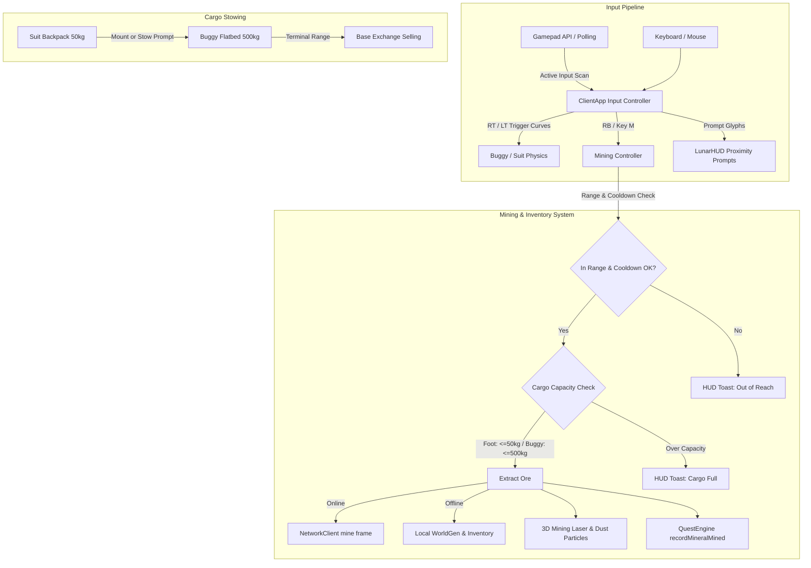

# Spec 19: Lunar Frontier — Gamepad Controls Overhaul, Mining UX & Tiered Cargo Capacity

> **Target Systems:** `games/lunar-frontier/src/client/ClientApp.ts`, `games/lunar-frontier/src/ui/LunarHUD.ts`, `games/lunar-frontier/src/ui/hud.css`, `games/lunar-frontier/src/entities/AstronautSuit.ts`, `games/lunar-frontier/src/entities/OpenBuggy.ts`, `games/lunar-frontier/src/engine/WorldScene.ts`.  
> **Platforms:** WebGL2/WebGPU Desktop (Chrome/Firefox), Steam Deck & Handhelds (GPD Win Max 2, Linux Gamepad API).  
> **Preceding Specs:** Spec 12 (Multiplayer & Economy), Spec 14 (Key Sheet & Onboarding), Spec 16/17 (Rover Kinematics & Controller Tuning), Spec 18 (Quest Framework & Telemetry).

---

## 1. Executive Summary & Problem Statement

Field evaluation of the *Lunar Frontier* client surfaced three critical usability and interaction defects:

1. **Defective Gamepad Experience:**
   - **Linux & Handheld Trigger Blindness:** On Linux/ChromeOS/SteamOS (including GPD Win Max 2 and Steam Deck), analog triggers (LT/RT) report on `axes[4]` and `axes[5]` (or `axes[2]`), while `buttons[6]` and `buttons[7]` return zero. Players were unable to accelerate or brake.
   - **Inability to Reverse on Triggers:** RT only applied forward throttle and LT only applied service brake. Holding LT while stationary never shifted into reverse gear, leaving gamepad drivers permanently wedged against rocks.
   - **Missing Look Pitch (Right Stick Y):** Right stick vertical movement (`axes[3]`) was omitted from input polling, making it impossible to tilt the view up or down.
   - **Unmapped Actions & Naive Device Selection:** Mining (`KeyM`), camera cycle (`KeyV`), and comms (`KeyL`) had zero gamepad bindings. `pollGamepad()` selected `pads[0]` blindly, frequently locking onto phantom or virtual controller devices.
   - **Keyboard-Centric Prompts:** Proximity prompts continuously displayed keyboard keys (`[E]`, `[M]`, `[T]`) even when driving via controller.

2. **Unresponsive Mining Interaction (`[M]` Key):**
   - **Network Block:** `mineNearestVein()` required `network.state === 'open'`. Running in Vite dev or offline single-player silently aborted extraction.
   - **Invisible Feedback:** All error notifications routed to `#trade-feedback`, a DOM element inside the hidden `#trade-dialog` modal (`display: none`). Players received zero feedback on range, offline status, or cooldowns.
   - **Lack of Visual/Spatial Feedback:** Successful mining produced no 3D laser/drill beam, particle spark, or regolith dust in Babylon.js.

3. **Cargo Capacity Imbalance (Suit vs Buggy):**
   - Mined materials flowed into an unbounded abstract ledger without physical constraints.
   - The player suit had no backpack mass limit, undermining the economic and logistical rationale for deploying and driving the industrial lunar rover.

Spec 19 rectifies these flaws into a cohesive, responsive controller and resource extraction loop.

---

## 2. Functional Requirements & Specifications

### 2.1 Gamepad Subsystem Rectification (`ClientApp.ts`)
1. **Multi-Gamepad Active Input Polling:**
   - Scan all connected gamepads (`navigator.getGamepads()`) each frame. Lock onto the pad demonstrating recent button or axis activity above deadzones ($>0.15$), avoiding dormant virtual devices at index 0.
2. **Linux/DirectInput Analog Trigger Fallback:**
   - Detect RT (throttle) across `buttons[7].value`, `axes[5]`, and `axes[2]`.
   - Detect LT (brake) across `buttons[6].value` and `axes[4]`.
   - Normalize trigger axes resting at $-1.0$ to standard $0.0 \dots 1.0$ unipolar travel.
3. **Brake-to-Reverse Drive Logic:**
   - When rover speed is below stationary threshold ($|v| \le 0.3\,\text{m/s}$) and the brake trigger is held ($\text{LT} \ge 0.15$), transition powertrain into reverse drive mode, routing LT pressure into proportional reverse throttle ($-1.0 \dots 0.0$).
   - Releasing LT or pressing RT instantly returns to forward drive mode.
4. **Camera Look Pitch (Right Stick Y):**
   - Map `axes[3]` to view pitch with deadband ($dz = 0.15$) and exponential smoothing curve.
5. **Full Gamepad Action Sheet:**
   - **RB (Button 5):** Mine nearest vein.
   - **R3 (Button 11):** Cycle camera mode (`eva_first_person` $\to$ `eva_third_person` $\to$ `vehicle_chase`).
   - **Button X (Button 2):** Mount/Dismount buggy; stow cargo to buggy when on foot near rover.
   - **Button Y (Button 3):** Toggle headlights / suit lamps.
   - **Button B (Button 1):** Toggle trade terminal / Back / Dismiss UI.
   - **Button A (Button 0):** Jump (on foot) / Handbrake (in buggy).
   - **D-Pad Up (Button 12):** Comms terminal toggle (`KeyL`).
6. **Adaptive Input HUD Prompts:**
   - Track last active input source (Keyboard/Mouse vs Gamepad).
   - Dynamically render prompt glyphs: `(X) Drive`, `(RB) Mine Vein`, `(B) Trade`, `(Y) Lamp` when controller is active, falling back to `[E]`, `[M]`, `[T]`, `[F]` on keyboard.

---

### 2.2 Mining Interaction, Offline Fallback & 3D Visual Feedback

1. **Offline & Single-Player Local Extraction:**
   - When `network.state !== 'open'`, execute mining against the local `LunarWorldGenerator` survey via `harvest()`.
   - Deposit mined resources into the local player inventory (suit backpack or buggy flatbed).
   - Update `QuestEngine` via `recordMineralMined(resource, amount)` to satisfy tutorial and mission objectives seamlessly without a live server connection.
2. **Prominent HUD Toast & Status Notification:**
   - Create a dedicated floating HUD notification banner `#lunar-hud-toast` for gameplay feedback.
   - Display unambiguous status messages with distinct styling:
     - `Drilling [Vein ID] (+20 kg Regolith)` (success)
     - `Vein out of drill reach (XX m)` (error/warning)
     - `No mineral signatures in drill range` (error/warning)
     - `Drill cooling down...` (info)
     - `Suit backpack full! Stow in buggy flatbed.` (warning)
3. **3D Mining Laser Beam & Particle Spurt in Babylon.js (`WorldScene.ts`):**
   - When mining is engaged, create an emissive pulsing laser cylinder or ray line between the avatar/buggy mining emitter point and the vein center.
   - Spawn a momentary spark/dust particle flare at the rock impact site.
   - Auto-fade and clean up visual meshes after drill duration ($600\,\text{ms}$).

---

### 2.3 Tiered Cargo Capacity & Material Stowing (Suit vs Buggy)

1. **Backpack vs Flatbed Capacity Allocation:**
   - **Suit Backpack:** Max capacity **$50\,\text{kg}$**. Lightweight handheld exploration only.
   - **Buggy Flatbed:** Max capacity **$500\,\text{kg}$**. Heavy industrial haulage.
2. **Mining Capacity Checks:**
   - While on foot, mining checks: `suitCargoMass + amount <= SUIT_MAX_CARGO (50 kg)`. If exceeded, cap extraction or reject with `"Suit backpack full (50/50 kg)"`.
   - While mounted in the buggy, mining deposits directly to the flatbed: `buggyCargoMass + amount <= BUGGY_MAX_CARGO (500 kg)`.
3. **Cargo Transfer / Stowing Mechanics:**
   - When on foot within mount radius ($\le 3\,\text{m}$) of the buggy, display prompt: `(X) Stow Cargo to Buggy` (or `[E]` / `[X]`).
   - Entering/mounting the buggy automatically transfers all stowed backpack ore to the rover flatbed.
4. **HUD Telemetry Reflection:**
   - Suit HUD panel shows backpack cargo: `CARGO: XX / 50 kg` with progress fill bar.
   - Buggy dashboard and cockpit HUD show flatbed cargo: `CARGO: XXX / 500 kg`.

---

## 3. Architecture & Interfaces

---

## 4. Verification & Acceptance Criteria

1. **Gamepad Test Suite:**
   - Gamepad active polling locks onto active controllers across slots.
   - Linux XInput trigger axes (`axes[4]`, `axes[5]`) correctly actuate throttle and brake.
   - Holding LT while stopped engages reverse drive.
   - Right stick Y correctly adjusts view pitch.
   - RB triggers mining in range; R3 cycles cameras.
   - HUD prompt labels dynamically display controller glyphs.
2. **Mining Test Suite:**
   - Pressing `[M]` or `(RB)` while offline extracts ore and updates local inventory/world survey.
   - On-screen toast banner displays clear feedback for successes and range/cooldown rejections.
   - 3D laser effect and impact flare appear in scene during drilling.
3. **Cargo Capacity Test Suite:**
   - Suit backpack caps at $50\,\text{kg}$; rejects mining when full.
   - Mounting or stowing transfers backpack cargo to the buggy up to $500\,\text{kg}$.
   - HUD telemetry correctly paints suit and buggy cargo bars.
