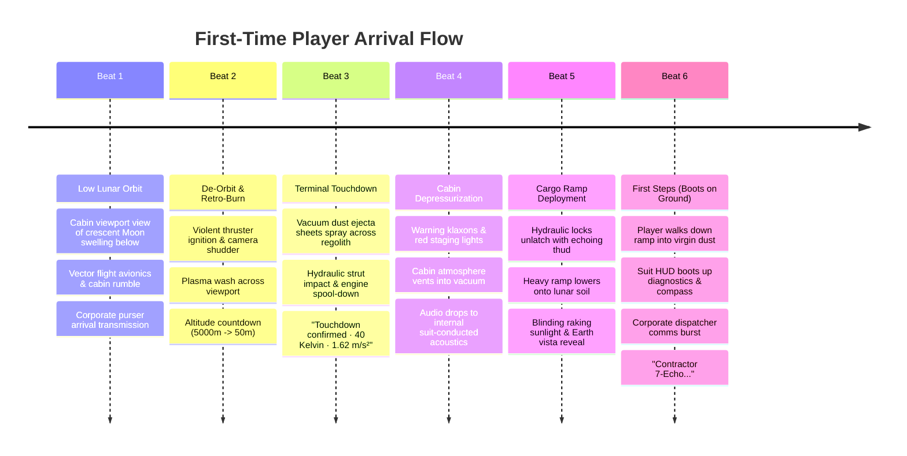
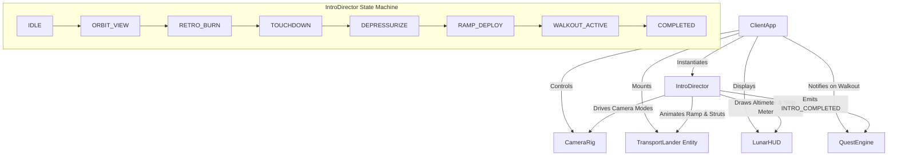
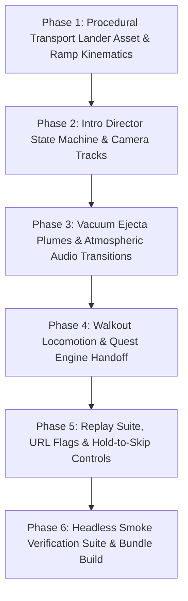

# Spec 24: Lunar Frontier — Transport Flight, Orbital Descent & First-Landing Experience

> **Target Systems:** `games/lunar-frontier/src/client/IntroDirector.ts` (new), `games/lunar-frontier/src/entities/TransportLander.ts` (new), `games/lunar-frontier/src/engine/CameraRig.ts`, `games/lunar-frontier/src/ui/LunarHUD.ts`, `games/lunar-frontier/src/ui/hud.css`, `games/lunar-frontier/src/client/ClientApp.ts`, `games/lunar-frontier/src/client/QuestEngine.ts`.  
> **Platforms:** WebGL2/WebGPU Desktop (Chrome/Firefox), Steam Deck & Handhelds (GPD Win Max 2, Gamepad API).  
> **Preceding Specs:** Spec 12 (Multiplayer & Economy), Spec 14 (Visual & Terrain Overhaul), Spec 18 (New Player UX & Quest Framework), Spec 21 (World Building), Spec 22 (Lobby Integration), Spec 23 (Surface Rendering & Visor Exposure).

---

## 1. Executive Summary & Problem Statement

In *Lunar Frontier*, the initial tutorial quest (*Spec 18: "A One-Way Ticket to the Frontier"*) introduces players to contractor life and basic mechanics (locomotion, mining, buggy driving, trading). However, when players boot the game for the very first time, they are abruptly spawned standing motionless on the lunar surface with no visual or emotional setup. 

The fiction establishes that the player is a down-on-their-luck contractor who signed away their freedom for a one-way ticket to the lunar frontier. Dropping directly onto the regolith without showing their arrival breaks immersion and misses the dramatic scale of space colonization:
1. **Missing Sense of Scale & Arrival:** The player never experiences the intimidating descent from low lunar orbit, the visceral violence of retro-thruster braking, or the stark, blinding transition from a pressurized cabin into the silent vacuum of the lunar surface.
2. **Disconnected Narrative Context:** Corporate dispatch comms ping immediately upon loading, but there is no environmental anchor explaining *how* the player got there, where their transport vessel is, or why they are stranded at a remote perimeter.
3. **No Iterative Test & Replay Tooling:** To evaluate and refine the onboarding flow, designers must currently wipe browser storage or manually alter code. There is no mechanism to quickly replay the intro, skip specific beats, or jump to intermediate phases during playtesting and design feedback passes.

**Spec 24** introduces an interactive, cinematic **First-Time Arrival Experience**:
- A dramatic multi-beat sequence encompassing **orbital descent**, **retro-thruster landing**, **cabin depressurization**, and **walking out of the transport rocket's cargo ramp onto the lunar regolith**.
- A dedicated **Replay & Test Suite** enabling instant restarts, URL query jump flags (`?intro=1`, `?intro_phase=...`), dev hotkeys, and hold-to-skip controls so designers and players can run through the experience repeatedly for evaluation and feedback.
- A seamless handoff into the Spec 18 Quest Engine as the player's boots touch the lunar dust.

---

## 2. Narrative Design & Atmospheric Beats



### 2.1 Beat 1: Low Lunar Orbit & The Cis-Lunar Viewport (Transit)
- **Setting:** Interior observation bay / passenger jump seat of the *CEC Ore-Hauler 9-Tango* (or faction-aligned dropship).
- **Visuals:** 
  - Framed viewport window looking out into the pitch-black cis-lunar void.
  - Distant Earth hangs like a blue-and-white marble.
  - The massive curved horizon of the Moon swells in the lower frame, its deep craters and jagged rims raked by harsh, un-scattered sunlight.
  - Interior cabin has flickering green/amber phosphor vector avionics screens, steel conduit piping, and subtle hydraulic vibrations.
- **Atmosphere & Audio:**
  - Low-frequency hum of inertial reaction wheels and RCS thrusters.
  - Automated ship PA announcement:
    > *"Flight 409-TransLunar on final approach vector to Malapert Rim / South Pole Aitken Basin. Orbital deceleration burn in T-minus 15 seconds. Contract debt accrual begins upon airlock egress. Secure all magnetic suit clamps."*
- **Player Interactivity:**
  - Unlocked free-look camera (`Mouse` / `Right Stick`) allows looking around the cabin and out the viewport.
  - Interactive visor diagnostic prompt: `[Press Space / Gamepad (A) to Initialize Visor Telemetry]`.

### 2.2 Beat 2: De-Orbit Retro-Burn & Descent Telemetry
- **Visuals:**
  - Main chemical/ion retro-thrusters ignite. Vibrant cyan/orange plume glare washes across the viewport frame.
  - Dynamic camera shake and subtle motion blur accentuate the deceleration force.
  - Vector descent HUD overlays on the viewport glass:
    - `ALTITUDE: 12,400 m ➔ 4,200 m ➔ 850 m ➔ 120 m`
    - `DESCENT RATE: 180 m/s ➔ 45 m/s ➔ 8 m/s`
    - `TRAJECTORY VECTOR: POLAR_SECTOR_07_LOCKED`
- **Audio:**
  - Muffled roar of the main engines echoing through the titanium hull frame.
  - Altimeter telemetry pings accelerating in tempo as surface proximity closes.

### 2.3 Beat 3: Terminal Descent & Touchdown
- **Visuals:**
  - As altitude drops below 40 meters, high-velocity vacuum ejecta plumes kick up dust across the regolith surface. Because the Moon has no atmosphere, the dust forms flat, hyperbolic ballistic sheets radiating outward without billowing or clouds.
  - Surface landmarks become sharp and menacing: giant shadowed boulders, crumbly impact crater rims, and long razor shadows cast across the landing footprint.
  - At 0m, the lander's 4 heavy telescopic hydraulic struts compress with an audible structural thud, bouncing slightly under 1/6th gravity before locking rigid.
- **Audio:**
  - Heavy mechanical strut impact, retro-thruster cutoff hiss, turbine spool-down whine.
  - Automated flight computer:
    > *"Touchdown confirmed. Landing zone secure. Ambient surface temperature: 40 Kelvin. Local gravity: 1.62 m/s². Atmospheric pressure: 0.00 kPa."*

### 2.4 Beat 4: Depressurization & Acoustic Cut
- **The Transition:**
  - Cabin overhead fluorescent lights snap off; amber/crimson emergency staging beacons rotate in silence.
  - **The Vacuum Acoustic Shift:** Heavy air vents hiss as the cabin atmosphere is evacuated. As air density reaches zero, external environmental audio abruptly vanishes.
  - Sound collapses to **suit-conducted acoustics**:
    - The contractor's own rhythmic breathing inside the helmet.
    - Low-frequency bone-conducted heartbeats and suit servo motor whines.
    - Radio static hiss and synthetic HUD chimes.

### 2.5 Beat 5: Cargo Ramp Deployment & The Reveal
- **Visuals:**
  - The heavy stern cargo ramp unlatches with two pneumatic clunks and slowly lowers downward to meet the lunar regolith.
  - As the ramp angles down, sunlight bursts across the floor:
    - Razor-sharp, high-contrast raking light cuts across the ribbed metal grating.
    - The vast lunar horizon opens up in front of the player: endless crater fields, distant towering central peaks, and Earth hovering permanently above the southern horizon.
- **Interactivity:**
  - Player controls unlock. Movement prompt displays: `[W,A,S,D] / Left Stick to Disembark`.

### 2.6 Beat 6: First Steps & The Frontier Handoff
- **Visuals & Mechanics:**
  - The player walks down the ramp. As boots touch the lunar dust for the first time:
    - Fine powder puffs kick up from the boot heels.
    - Low-gravity walking physics activate (gentle buoyant stride, high leaping capability).
  - The full exploration HUD initializes:
    - Visor boot sequence completes: Life-support status, O2 tank level, battery reserve, 360° top bearing compass tape.
  - Standing outside, the player can turn back and gaze up at their transport: a massive 28-meter tall industrial lander with thermal-insulation foil blankets, soot-stained engine bells, and blinking landing pad beacons.
- **Seamless Quest Bridge:**
  - Corporate dispatcher transmission triggers with scratchy radio burst audio:
    > *CEC-DISP: "Contractor 7-Echo, wake up. Life support telemetry verified. Transport dropped you at the perimeter. Check your helmet seals and move 10 meters toward the survey beacon..."*
  - Seamlessly starts Spec 18 Stage 1 ("Boots on the Ground").

---

## 3. Replay, Testing & Feedback Architecture

To enable rapid iteration and repeated test play-throughs without modifying cookies or editing database state:

```
┌────────────────────────────────────────────────────────────────────────┐
│                        INTRO REPLAY & TEST SUITE                       │
├───────────────────────────────┬────────────────────────────────────────┤
│ URL Query Overrides           │ ?intro=1 (Force full cinematic)        │
│                               │ ?skip_intro=1 (Jump straight to moon)  │
│                               │ ?intro_phase=descent|touchdown|ramp    │
├───────────────────────────────┼────────────────────────────────────────┤
│ In-Game HUD Menu              │ [🔄 Replay Arrival Cinematic] Button   │
│                               │ Accessible via Esc/Pause or HUD Top    │
├───────────────────────────────┼────────────────────────────────────────┤
│ Fast-Forward / Skip           │ Hold [Space] or Gamepad (B) (1.2s hold)│
│                               │ Circular radial fill UI overlay        │
├───────────────────────────────┼────────────────────────────────────────┤
│ Developer Hotkeys             │ [F8] / [Ctrl+Shift+R]: Instant Restart │
│ (when devMode === true)       │ [1]: Orbit  [2]: Retro  [3]: Touchdown │
│                               │ [4]: Depressurize  [5]: Ramp / Walkout │
└───────────────────────────────┴────────────────────────────────────────┘
```

### 3.1 URL Query Parameter Matrix
When launching the web client (e.g. `http://localhost:5174/` or through the Playground lobby), the client inspects query parameters before initializing scenes:

| Parameter | Type | Default | Description |
| :--- | :--- | :--- | :--- |
| `intro` | `boolean` (`1`/`0`) | `undefined` | When `intro=1`, forces playback of the intro sequence regardless of `localStorage` state. When `0`, suppresses intro. |
| `skip_intro` | `boolean` (`1`) | `undefined` | Alias for `intro=0`. Immediately spawns player on surface with tutorial active. |
| `intro_phase` | `string` | `'orbit'` | Jumps directly to a specific beat: `'orbit'`, `'burn'`, `'touchdown'`, `'depressurize'`, `'ramp'`, `'walkout'`. |
| `intro_speed` | `number` | `1.0` | Time multiplier for testing transitions quickly (`1.0`, `2.0`, `5.0`). |

### 3.2 Hold-to-Skip & Fast-Forward Mechanics
- At any point during the scripted cinematic beats (Beats 1–5), holding `[Space]` on the keyboard or `(B) / Circle` on a gamepad fills a sleek glassmorphic radial progress ring in the bottom-right corner:
  $$\text{Progress}(t) = \min\left(1.0, \frac{t - t_{\text{press}}}{1200\,\text{ms}}\right)$$
- If held for 1.2 seconds, the current phase immediately skips to the next beat (or pressing `[Esc]` immediately skips directly to Beat 6: Boots on Ground).
- A subtle UI prompt rests in the lower right: `Hold [Space / Ⓑ] to Skip`.

### 3.3 In-Game Replay Trigger
- A permanent debug/replay toggle is exposed in the HUD options menu: `[🔄 Replay Arrival Sequence]`.
- Triggering this button:
  1. Smoothly fades the canvas to black (`0.4s`).
  2. Resets the player avatar position back into the transport lander.
  3. Resets `IntroDirector` state machine.
  4. Re-engages cinematic camera and unrolls the arrival sequence.

### 3.4 Dev Hotkeys (Active in Development & Testing)
- `[F8]` or `[Ctrl+Shift+R]`: Wipe intro cache and immediately restart intro from Beat 1.
- `[1]`: Jump to Orbit Viewport.
- `[2]`: Jump to Retro-Burn Descent.
- `[3]`: Jump to Touchdown & Dust Ejecta.
- `[4]`: Jump to Depressurization & Audio Cut.
- `[5]`: Jump to Ramp Lowering & Walkout.

---

## 4. Technical Architecture & System Contracts



### 4.1 `TransportLander.ts` (Dropship Procedural Architecture)
The transport lander is generated procedurally using Babylon.js mesh primitives and materials to guarantee zero external asset loading dependencies and instant startup:
- **Hull:** Heavy cylindrical octagonal fuselage ($\varnothing 8.5\,\text{m}$, height $24\,\text{m}$) with faceted armor plating, heat-shield tiling on bottom base, and high-gain antenna mast.
- **Passenger Bay / Cockpit:** An interior cabin pocket with steel ribs, jump seats, and an observation viewport looking outward.
- **Landing Gear:** 4 symmetrical articulated outrigger landing legs with hydraulic piston cylinders and wide dish footpads ($\varnothing 2.2\,\text{m}$).
- **Hydraulic Cargo Ramp:** A 6-meter motorized ramp at the stern with ribbed tread plates, safety side railings, and hydraulic actuator cylinders that rotate downward from $0^\circ$ (sealed horizontal) to $-35^\circ$ (resting securely on terrain).
- **Thruster Cluster:** 4 gimballed descent engine bells with emissive throat interiors and dynamic point lights for retro-burn illumination.

```typescript
export interface TransportLanderOptions {
  scene: Scene;
  position: Vector3;
  headingRad?: number;
  rampAngleRad?: number;
}

export class TransportLander {
  readonly rootNode: TransformNode;
  readonly rampNode: TransformNode;
  readonly thrusterLights: PointLight[];

  constructor(options: TransportLanderOptions);
  
  /** Sets ramp deployment angle (0 = closed, 1 = fully open resting on regolith). */
  setRampDeployment(progress: number): void;
  
  /** Activates retro-thruster glow and dynamic lighting. */
  setThrusterIntensity(intensity: number): void;
  
  /** Triggers landing gear shock compression animation on touchdown. */
  triggerGearCompression(durationMs?: number): void;

  /** Returns world coordinate for the top of the ramp inside the cabin. */
  getCabinSpawnPoint(): Vector3;

  /** Returns world coordinate where the ramp meets the lunar dirt. */
  getRampExitPoint(): Vector3;

  dispose(): void;
}
```

### 4.2 `IntroDirector.ts` (Cinematic Sequencer & State Machine)
`IntroDirector` coordinates the timeline, camera transitions, HUD widgets, particle systems, and audio events:

```typescript
export type IntroPhase = 
  | 'idle'
  | 'orbit'
  | 'burn'
  | 'touchdown'
  | 'depressurize'
  | 'ramp'
  | 'walkout'
  | 'completed';

export interface IntroDirectorOptions {
  scene: Scene;
  cameraRig: CameraRig;
  hud: LunarHUD;
  lander: TransportLander;
  onPhaseChange?: (phase: IntroPhase) => void;
  onComplete?: () => void;
  timeScale?: number;
}

export class IntroDirector {
  phase: IntroPhase = 'idle';

  constructor(options: IntroDirectorOptions);

  /** Starts the arrival sequence from specified phase. */
  start(startPhase?: IntroPhase): void;

  /** Advances sequence by dt seconds (called from render loop). */
  update(dtSeconds: number): void;

  /** Skips current phase or entire intro immediately. */
  skipCurrentPhase(): void;
  skipToFinish(): void;

  /** Jumps directly to specified phase for rapid testing. */
  jumpToPhase(phase: IntroPhase): void;

  /** Resets state machine and cleans up intro effects. */
  reset(): void;

  /** Evaluates hold-to-skip input progress. */
  updateSkipInput(isHolding: boolean, dtSeconds: number): boolean;
}
```

### 4.3 Camera Rig Extensions (`CameraRig.ts`)
Add two dedicated camera modes to support the arrival sequence:
1. `'intro_cabin'`: An interior first-person camera positioned inside the transport dropship, constrained to $\pm 60^\circ$ yaw and $\pm 35^\circ$ pitch to examine the cabin and gaze out the observation window.
2. `'intro_cinematic'`: A smooth spline-interpolated tracking camera following the dropship descent from an exterior angle during retro-burn and touchdown.
3. Seamless lerp transition from `'intro_cabin'` to the standard `'eva_first_person'` camera as the player disembarks.

### 4.4 Particle Systems: Vacuum Retro-Ejecta
- **Physics Compliance (No Atmosphere):**
  Unlike Earth rocket plumes that generate billowing smoke clouds, lunar vacuum rocket exhaust produces **ballistic sheet ejecta**:
  - Particles have high horizontal velocity ($25\text{--}40\,\text{m/s}$).
  - Zero air resistance/drag ($\vec{a}_{\text{drag}} = 0$).
  - Constant downward gravity ($g = -1.62\,\text{m/s}^2$).
  - Particles bounce or stick upon hitting the regolith surface.
- Implemented via a lightweight Babylon.js `GPUParticleSystem` or thin-instance sprite emitter with a fixed budget ($\le 500$ particles) to prevent frame drops.

---

## 5. Implementation Phases & Task Decomposition



| Phase | Milestone Name | Key Files | Deliverables |
| :--- | :--- | :--- | :--- |
| **Phase 1** | **Transport Lander Model & Ramp Kinematics** | `TransportLander.ts`, `WorldScene.ts` | Octagonal lander hull, 4 landing struts, procedural materials, animated hydraulic ramp with angle lerping, and thruster lights. |
| **Phase 2** | **Intro Director & Camera Sequences** | `IntroDirector.ts`, `CameraRig.ts`, `ClientApp.ts` | Multi-beat state machine (`orbit`, `burn`, `touchdown`, `depressurize`, `ramp`, `walkout`), cabin viewport camera, and cinematic exterior tracking. |
| **Phase 3** | **Vacuum Ejecta, Lighting & Acoustic Shift** | `IntroDirector.ts`, `LunarHUD.ts`, `hud.css` | Ballistic vacuum dust particles, dynamic thruster glare, cabin red staging lights, and audio dampening to suit acoustics. |
| **Phase 4** | **Walkout Locomotion & Quest Bridge** | `ClientApp.ts`, `QuestEngine.ts`, `AstronautSuit.ts` | Seamless control uncoupling, ramp descent walking, boot dust footsteps, full HUD boot sequence, and handoff to Spec 18 Stage 1 comms. |
| **Phase 5** | **Replay Suite, URL Flags & Skip UX** | `IntroDirector.ts`, `LunarHUD.ts`, `ClientApp.ts` | `?intro=1` / `?intro_phase=` URL parameters, `[🔄 Replay Intro]` HUD button, radial hold-to-skip overlay, and dev hotkeys (`F8`, `1-5`). |
| **Phase 6** | **Headless Verification Suite & CI Gates** | `smoke-intro-experience.ts`, `ClientApp.ts` | Comprehensive headless smoke test suite verifying all state transitions, skip logic, replay resets, and bundle compilation. |

---

## 6. Verification & Acceptance Criteria

1. **First-Time Player Experience:**
   - A fresh client session without prior saved progress initiates the arrival sequence in Beat 1 (Orbit Viewport).
   - The sequence progresses naturally through retro-burn, touchdown, depressurization, and ramp deployment without hitching or player confusion.
2. **Atmospheric & Audio Fidelity:**
   - Cabin depressurization cleanly transitions audio from atmospheric hum to muffled suit-conducted acoustics.
   - High-contrast raking sunlight illuminates the ramp and regolith during the reveal.
3. **Walkout & Locomotion Handoff:**
   - Player can walk down the ramp smoothly under 1/6th gravity.
   - Crossing from the ramp to the lunar soil triggers footstep particles, suit HUD boot, and the Spec 18 Stage 1 corporate dispatch transmission.
4. **Replayability & Testing Tools:**
   - Loading `?intro=1` forces intro playback regardless of prior progress.
   - Loading `?intro_phase=touchdown` jumps straight to the landing moment.
   - Holding `[Space]` or Gamepad `(B)` for 1.2s displays a radial fill and skips cleanly to the next beat.
   - Pressing the HUD `[🔄 Replay]` button resets the sequence cleanly without memory leaks, camera glitches, or duplicate lander meshes.
5. **Headless Verification Suite:**
   - `npx tsx scripts/smoke-intro-experience.ts` executes in headless Node/NullEngine, asserting 100% of state machine transitions, event callbacks, skip logic, and reset handlers.
6. **No Regressions:**
   - Existing buggy driving (Spec 17), mining & gamepad controls (Spec 19/20), world structures (Spec 21), and lobby bridge (Spec 22) remain completely operational.
